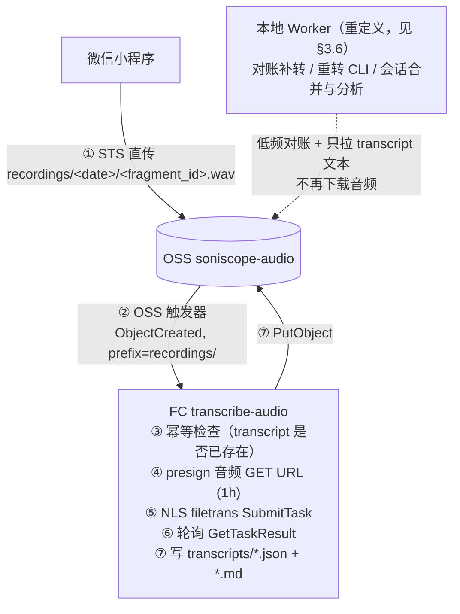

# FC 直接转写 OSS 音频方案设计（transcribe-audio）

> 状态：**已决策，部署阶段立即实施**（决策记录见 `docs/transcribe-approach-comparison.md` §6：项目处于部署阶段，FC 直转作为主转写路径直接进入部署验收范围，不走二期演进）。本文是「由阿里云 FC 直接把 OSS 上的音频转译成文字，并把结果以 Markdown 落回 OSS」的实施方案。
>
> 现状权威来源：`docs/tech-spec.md`（§1 架构、§5.2 转写策略、§6.4 FC 部署）。

---

## 1. 结论（TL;DR）

**可行，且改动面小。** 依据：

1. **转写链路已被验证**：Worker 的 `oss-url` 模式（`apps/worker/src/soniscope_worker/nls.py`）已经证明「OSS 签名 URL → NLS 录音文件识别（filetrans）→ 轮询取结果」全链路可用。FC 与 OSS、NLS 同账号同 region（cn-beijing），把这段逻辑搬进 FC 没有网络 / 权限上的硬障碍。
2. **FC 侧基建已就绪**：FC 3.0 Custom Runtime（`python3 app.py` + WSGI handler）模式、打包部署脚本（`fc_deploy.py` / `make deploy-fc`）、环境变量注入约定（tech-spec §4.0）均可直接复用。
3. **触发机制现成**：FC 3.0 原生支持 OSS 事件触发器（`oss:ObjectCreated:PutObject`，可按前缀 `recordings/` 过滤），音频上传即自动触发转写，无需轮询。

**与现有架构的关系**：本方案是**增量旁路**，不动现有「小程序 → FC 签发 STS → OSS → Worker」主链路。FC 转写产物写到 OSS 新前缀 `transcripts/`，Worker 与本地目录协议（§2.2 / §3.5）完全不受影响。

---

## 2. 现状盘点（检查结果）

| 项 | 现状 | 对本方案的意义 |
|---|---|---|
| FC 函数 | 仅 `issue-credential` / `verify-upload` 两个 Web 函数（HTTP 触发） | 需新增第三个函数 `transcribe-audio`（OSS 事件触发） |
| 转写实现 | 全部在本地 Worker：轮询 OSS → 下载 → ffmpeg 标准化 → NLS 转写 → 本地落盘 | filetrans 直接拉 OSS **原始 object**（含 m4a/mp3 等），FC 侧**不需要 ffmpeg**，无需下载音频本体 |
| NLS 调用 | `nls.py`：presign 1h URL → SubmitTask → 5s 间隔轮询 → 映射为 segments | 核心逻辑可平移；FC 场景下音频 ≤ 10 分钟/片（前端分片阈值），无需 50 分钟续签逻辑 |
| FC 部署 | `fc_deploy.py` 只支持 `update_code`（更新代码包），`FUNCTIONS` 元组硬编码两个函数 | 函数创建、OSS 触发器、环境变量仍需一次性人工准备（与现有 US-001(H) 模式一致），之后 `FUNCTIONS` 加一项即可纳入 `make deploy-fc` |
| 权限 | `soniscope-fc` 子账号：STS AssumeRole + HeadObject | 需增授：`oss:GetObject`（presign 拉音频）、`oss:PutObject`（限 `transcripts/*` 前缀）、NLS 调用权限 + AppKey |
| 红线 | OSS 永不删除（PRD FR-11） | 本方案只新增 object，不触碰红线 |

---

## 3. 方案设计

### 3.1 架构



### 3.2 新函数 `transcribe-audio`

- **目录**：`apps/fc/transcribe_audio/`（snake_case，同现有约定），云端函数名 `transcribe-audio`。
- **触发器**：OSS 事件触发器，事件 `oss:ObjectCreated:*`，前缀 `recordings/`，后缀 `.wav`。**异步调用**（OSS 触发器默认异步），配置失败目标（Destination）便于观测。
- **运行时**：与现有函数一致的 Custom Runtime。注意：OSS 触发器投递的是事件而非普通 HTTP 业务请求，`handler.py` 需从请求体解析 OSS 事件 JSON（`events[].oss.object.key`），复用现有 WSGI 形态即可，`shared/app.py` 无需改动。
- **超时**：900s。单片音频 ≤ 10 分钟（前端 `CHUNK_MAX_DURATION_SECONDS=600`），filetrans 通常 1–3 分钟出结果，900s 余量充足。
- **内存**：512MB 足够（纯 API 调用，无音频处理）。

### 3.3 处理流程（函数内部）

```
1. 解析 OSS 事件 → object key → fragment_id（复用现有 key 解析规则 §3.2）
2. 幂等检查：HeadObject transcripts/<date>/<fragment_id>.md
   存在 → 直接返回 200（OSS 事件至少一次投递，必须幂等）
3. presign GET URL（1 小时）→ NLS filetrans SubmitTask（appkey + file_link）
4. 每 5s 轮询 GetTaskResult，直到 SUCCESS / 失败
5. 结果映射为 segments（平移 nls.py 的 filetrans_to_result 逻辑）
6. 先 PutObject transcripts/<date>/<fragment_id>.json（结构同 §3.4 transcript.json）
   再 PutObject transcripts/<date>/<fragment_id>.md（人类可读产物，最后写 = 完成标记）
7. 输出 §6.8 结构化成本日志（event=asr_call_completed，含 estimated_cost_yuan）
```

**错误处理**：沿用 §1.5 统一策略 —— 网络/5xx 指数退避 3 次；4xx 立即失败。函数抛错时 FC 异步调用自身还会按重试策略重试，幂等检查保证不会重复计费转写已成功的片段。

### 3.4 Markdown 产物格式

OSS key：`transcripts/<YYYY-MM-DD>/<fragment_id>.md`

```markdown
# 转写稿 · 20260526T144800_dev01_01HZX…

- fragment_id: 20260526T144800_dev01_01HZX3K8MN5PQR9TFB7AYWVCDE
- 录音时间: 2026-05-26T14:48:00+08:00（来自 x-oss-meta-recorded-at）
- 时长: 87.5s ｜ 模型: 中文普通话（识音石 V1 - 端到端模型) ｜ provider: aliyun-nls
- 转写完成: 2026-05-26T14:49:12+08:00

---

[00:00] 今天天气不错
[00:02] 我准备去公园跑步
```

元数据来自 HeadObject 读回的 `x-oss-meta-*`（ADR-8 已定义，FC 侧同样适用）。分片录音每片独立一份 md；按 `session_id` 合并成整段文档不在本方案范围（可作为 Worker 或后续 FC 函数的增强）。

### 3.5 环境变量（新增，FC 控制台注入）

| 变量 | 说明 |
|---|---|
| `NLS_APPKEY` | NLS 项目 soniscope 的 AppKey |
| `NLS_AK_ID` / `NLS_AK_SECRET` | 调 NLS + presign/PutObject 的 AK（建议新子账号 `soniscope-fc-transcribe`，最小权限） |
| `TRANSCRIPT_PREFIX` | 产物前缀，默认 `transcripts/` |
| 复用 | `OSS_BUCKET` / `OSS_REGION` / `OSS_ENDPOINT` |

RAM 授权（`soniscope-fc-transcribe`）：`oss:GetObject`（`recordings/*`）、`oss:HeadObject`、`oss:PutObject`（**仅** `transcripts/*`）、NLS 智能语音交互调用权限。刻意不给 `recordings/*` 的写权限和任何 Delete 权限。

### 3.6 Worker 职责重定义

**决策：Worker 不再下载 OSS 上的音频。** 音频持久性由 OSS 保证（私有 Bucket、永不删除，PRD FR-11），转写由 FC 完成；「下载音频 + ffmpeg 标准化 + 本地音频归档」这条现状主干整体移除，连带 `inbox/.part` 下载状态机、`audio.wav` 落盘、50GB 磁盘预留一并退役。冷备是将来按需批量拉取的一次性脚本（如 `make cold-backup`），不属于常驻后端职责。

Python 后端的角色从**数据搬运管道**转为**控制面 + 分析面**，职责按重要性排序：

| # | 职责 | 说明 |
|---|---|---|
| 1 | **对账与补转**（安全网，必须有） | 事件投递不能假设 100% 送达（触发器配置窗口、FC 重试耗尽、NLS 偶发失败）。低频轮询（小时/天级，替代现在的 60s）对 `recordings/` 与 `transcripts/` 两前缀做差集，对缺口 fragment 手动 invoke `transcribe-audio` 补转，持续失败的记入失败清单。事件驱动负责快，轮询对账负责全——现有 poller 骨架降频复用，轮询对象从音频本体变为 key 列表 |
| 2 | **重转与运维 CLI**（现有资产保值） | `retranscribe --force / --upgrade / --all-from` 语义不变，执行方式从「本地调 NLS」改为「删除/标记旧 transcript + invoke FC」。模型升级批量重转、单条修复仍走本地 CLI |
| 3 | **会话合并与下游分析**（产品价值所在，未来主业） | 按 `session_id` 把分片 transcript 合并为完整一段（FC 按片转写，天然缺这步）；日级汇总拉当天全部 transcript（纯文本，几十 KB）做摘要 / 主题归类 / 待办提取（接 LLM）。只下载文字，不下载音频 |
| 4 | **观测与成本对账** | 消费 §6.8 `asr_call_completed` 成本日志（SLS 侧）或按 transcripts 产物统计当日用量，与 NLS 账单对账 |
| 5 | **冷备通道**（保留能力，不启用） | 离线批量拉取脚本，按需执行，非常驻 |

**配套取舍与回退**：

- `cloud-speech` transcriber 保留为配置级回退项（`config.yaml` 一行切回本地调 NLS），不作为并行运行路径；一致性验证用 `tests/audio/` 基线素材做**一次性** diff（FC 产物 vs Worker 本地转写），验证完即收敛，避免双份 ASR 计费（双跑 ≈ +¥37.5/月）。
- **完整性校验降级**：现状 `verify-e2e-sha256` 依赖下载音频算 hash；不下载后降级为**抽样校验**（对账进程随机抽取少量 fragment 下载校验后即删），日常以 OSS 传输层校验 + FC verify 的 size 校验为完整性保证。
- 本地目录只保留 transcript 与分析产物，`fragments/` 下不再出现 `audio.wav`；tech-spec §2.2 / §3.5 的目录与状态机协议需在实施时同步修订。

### 3.7 成本增量

| 项 | 估算 |
|---|---|
| NLS ASR | 不变（¥37.5/月，同一批音频，只是调用方从 Worker 换成 FC；双跑期除外） |
| FC 执行 | 日均 30 分钟音频 ≈ 3–4 片/天，每片函数驻留（含轮询等待）约 2–3 分钟，512MB 规格 → 每月 ≈ ¥0.1–0.3 |
| OSS 存储 | transcript json+md 每片几 KB，忽略不计 |
| **增量合计** | **< ¥0.5/月**（收敛后） |

---

## 4. 风险与限制

| 风险 | 说明 | 缓解 |
|---|---|---|
| OSS 事件至少一次投递 | 同一 object 可能触发多次 | 幂等检查（3.3 步骤 2），以 md 存在为完成标记 |
| FC 驻留轮询计费 | 函数在轮询期间持续计费 | 单片 ≤10 分钟音频轮询窗口短（分钟级）；如未来接入超长音频，改用 NLS callback 回调到独立 HTTP 函数，拆成 submit/receive 两段 |
| 部署脚本不建函数/触发器 | `fc_deploy.py` 只更新代码包 | 沿用现有模式：函数创建 + 触发器 + 环境变量走一次性人工准备（runbook 登记），之后纳入 `make deploy-fc` |
| 存量音频不触发 | OSS 触发器只对新上传生效 | 补一个一次性回填脚本（列 `recordings/` 前缀，对缺 transcript 的 key 手动 invoke 函数） |
| NLS 结果丢失风险 | FC 实例崩溃时任务结果未落盘 | FC 异步重试 + 幂等重转即可恢复（NLS 任务本身可重提交） |
| 与 tech-spec 的一致性 | 本方案引入新数据前缀 `transcripts/` | 实施时需在 tech-spec 增补章节（OSS key 规则 §3.2 扩展 + 新 ADR） |

---

## 5. 实施清单（部署阶段内全部完成，按序执行）

1. **人工准备**（一次性）：建子账号 `soniscope-fc-transcribe` + RAM 授权；FC 控制台创建 `transcribe-audio` 函数 + OSS 触发器 + 环境变量；runbook 登记。
2. **代码**：`apps/fc/transcribe_audio/handler.py`（OSS 事件解析 + 幂等 + NLS filetrans + md 渲染，逻辑平移自 `nls.py`，纯逻辑部分保持可单测）；`fc_deploy.py` 的 `FUNCTIONS` 加入 `transcribe-audio`。
3. **测试**：单测（FakeNlsBackend 模式复用）+ `make test-fc-live` 增加转写联调用例（用 `tests/audio/sample-20s.wav` 上传触发，断言 transcripts/ 出现 json+md）。
4. **一致性验证**（一次性）：FC 产物 vs Worker 本地转写结果 diff，通过即进入下一步收敛。
5. **Worker 职责重定义落地**（同阶段必做，非可选，见 §3.6）：移除音频下载 / ffmpeg 标准化 / `audio.wav` 落盘路径；poller 降频改造为 `recordings/` vs `transcripts/` 对账补转；`retranscribe` CLI 改为 invoke FC；`cloud-speech` 保留为回退配置。
6. **验收基线**：mvp-acceptance E2E 以「OSS 事件 → FC 转写 → transcripts/ 产物 → Worker 对账确认」为主链路重新过一遍。
7. **文档**：tech-spec 同步修订——增补 `transcripts/` key 规则与新 ADR；§2.2 运行时目录、§3.5 文件状态机、§6.6 成本表按 Worker 新职责修订（sha256 校验降级为抽样，见 §3.6）。
