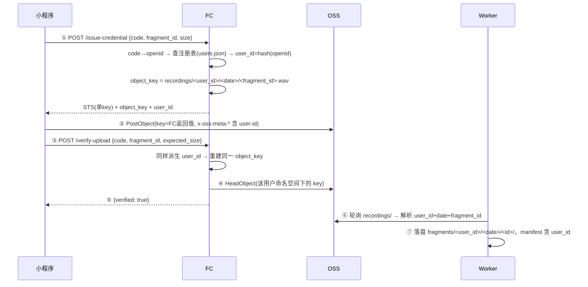

# SoniScope 多用户方案设计（Multi-User Design）

> 状态：设计稿（Draft v1，2026-07-04）
> 范围：微信小程序端多用户 —— 多个不同的微信用户使用同一小程序上传音频，云端与 Worker 按用户隔离数据归属。
> 关联文档：`docs/PRD_v1.md`（产品需求）、`docs/tech-spec.md`（技术权威）、`docs/runbook/cloud-setup.md`（真实云资源）。
> 本文档定稿后，需按 AGENTS.md 约定同步更新上述三处的对应章节。

---

## 目录

1. [背景与目标](#1-背景与目标)
2. [现状分析（代码级）](#2-现状分析代码级)
3. [多用户差距总结](#3-多用户差距总结)
4. [总体设计](#4-总体设计)
5. [详细设计 — FC 云函数](#5-详细设计--fc-云函数)
6. [详细设计 — 微信小程序](#6-详细设计--微信小程序)
7. [详细设计 — Python Worker](#7-详细设计--python-worker)
8. [用户注册与管理](#8-用户注册与管理)
9. [兼容与迁移](#9-兼容与迁移)
10. [安全设计](#10-安全设计)
11. [分阶段实施计划](#11-分阶段实施计划)
12. [测试与验收](#12-测试与验收)
13. [风险与开放问题](#13-风险与开放问题)
14. [附录 A：改动文件清单](#附录-a改动文件清单)
15. [附录 B：新旧协议对照](#附录-b新旧协议对照)

---

## 1. 背景与目标

### 1.1 背景

当前 MVP 明确是**单用户系统**（PRD §6 Non-goals：本期不做多用户登录系统）。"多用户"目前仅体现为 FC 环境变量 `OPENID_ALLOWLIST` 里硬编码的 2 个体验者 openid（runbook §4.2：`老庄道人`、`Bemied`）。所有用户上传的音频在 OSS 和 Worker 本地完全混在一起，**系统无法回答"这条录音是谁的"**。

### 1.2 本期目标（多用户 MVP）

1. **多人可用**：多个不同微信用户可以各自在小程序中录音并上传，无需改代码、重新部署即可增删用户。
2. **数据归属**：每条音频/转写从上传到落盘全链路携带用户身份，OSS 和本地目录按用户隔离。
3. **越权不可能**：用户 A 拿到的 STS 凭证在物理上（policy 层面）无法写入用户 B 的命名空间；verify 同样只能查自己的对象。
4. **不丢不重的承诺不变**：多用户改造不得破坏现有"音频与转写不丢、不重、不虚构"的核心承诺与三段式落盘协议。
5. **保持无数据库架构**：延续"OSS object 是唯一数据契约 + 本地文件状态机"的哲学，本期不引入数据库。

### 1.3 本期非目标（Non-goals）

- ❌ 用户之间互相查看/分享录音或转写结果
- ❌ 转写结果回传小程序展示（仍是 Worker 本地落盘，见 §13 开放问题）
- ❌ 微信昵称/头像采集与展示（Phase 3 可选）
- ❌ 计费、付费订阅
- ❌ Web 管理后台（本期用 make 命令管理用户）

---

## 2. 现状分析（代码级）

### 2.1 用户身份的现状：openid 只是"通行证"，不是"归属标识"

| 环节 | 现状 | 代码位置 |
|---|---|---|
| 前端登录 | 每次上传/verify 都 `wx.login()` 拿一次性 code，**不缓存任何 openid/session/用户态** | `apps/miniprogram/utils/queue_runtime.js:83-92`、`utils/uploader.js:74-86`、`utils/verify.js:68-87` |
| FC 换取 openid | `code_to_openid()` 调 `jscode2session`，失败统一 401 `INVALID_CODE` | `apps/fc/shared/fc_shared/wechat.py:29-52` |
| 准入控制 | `check_allowlist()` 明文比对环境变量 `OPENID_ALLOWLIST`（逗号分隔），不在则 403 `OPENID_NOT_ALLOWED` | `apps/fc/shared/fc_shared/auth.py:33-36`、`env.py:128-130` |
| 身份留痕 | openid 仅以 16 位截断 sha256 哈希（`hash_openid`）写入审计日志 | `apps/fc/shared/fc_shared/audit.py:35-37` |
| 数据平面 | **openid 从不写入 OSS key、STS policy、x-oss-meta、manifest** | 全链路确认 |

关键结论：`AuthContext`（`auth.py:24-30`）里已经握着 `openid` 和 `openid_hash`，但在签发 STS 时被丢弃了——身份信息止步于鉴权层，没有进入数据平面。

### 2.2 存储命名的现状：无用户维度

**OSS object key**（`apps/fc/shared/fc_shared/sts.py:46-59` `object_key_for()`）：

```
recordings/<YYYY-MM-DD>/<fragment_id>.wav
```

- 日期从 fragment_id 自身解析（不是服务器时间）
- fragment_id 格式校验正则：`^<YYYYMMDD>T<HHMMSS>_<deviceShortId 4-8位字母数字>_<26字符ULID>$`（`sts.py:30-33`）
- 所有用户的录音平铺在同一 `recordings/<date>/` 前缀下

**fragment_id 中的 `deviceShortId` 是设备标识，不是用户标识**（`apps/miniprogram/utils/device.js`）：

- 首次启动随机生成 6 位字符，持久化在 `soniscope:device_short_id`
- 与微信账号无关；且前端可控，**不可作为服务端信任的身份依据**

**Worker 本地目录**（`apps/worker/src/soniscope_worker/poller.py:69-76`）：

```
$SONISCOPE_HOME/fragments/<YYYY-MM-DD>/<fragment_id>/
```

同样无用户层级。`manifest.json`（`manifest.py:108-164`）里也没有任何用户字段，只有 `device_id`。

### 2.3 STS 授权的现状：已是单文件精确授权（好基础）

`single_key_policy()`（`sts.py:62-73`）签发的 policy：

```json
{
  "Version": "1",
  "Statement": [{
    "Effect": "Allow",
    "Action": ["oss:PutObject"],
    "Resource": ["acs:oss:*:*:soniscope-audio/recordings/<date>/<fragment_id>.wav"]
  }]
}
```

Resource 精确到单个 object key、只允许 `oss:PutObject`、有效期 ≤ 900 秒。这个"每次上传签发一把只能开一扇门的钥匙"的模型**天然适配多用户**——只要 key 里含用户段，隔离就是 policy 级别的，而非仅业务逻辑级别。

### 2.4 前端上传的关键约定：object_key 必须用 FC 返回值

`apps/miniprogram/utils/uploader.js:102`（对应 US-012 AC#4）：前端直传 OSS 时的 key **必须原样使用 `/issue-credential` 响应中的 `object_key`**，不允许前端自行拼接。签名走 OSS V4 PostObject 表单协议（`utils/oss_sign.js`），policy 条件中 `['eq','$key',objectKey]` 锁死 key。

> **这是本方案最大的幸运点**：OSS key 结构变更是纯服务端行为，前端上传链路**零改动**即可兼容新 key 格式。

### 2.5 Worker 轮询与落盘的现状

- 轮询 prefix：`RECORDINGS_PREFIX = "recordings/"`（`poller.py:30`），ListObjectsV2 全量分页拉取
- key → fragment_id 反解：`fragment_id_from_key()`（`poller.py:47-61`），通过 `object_key_for(fid) == key` 往返校验，不合法的 key 进 `ignored_keys` 静默忽略
- 已处理判定：本地 `.done` 标记（`poller.py:333`），无数据库、无游标
- 元数据：HeadObject 读 7 个 `x-oss-meta-*` 字段（`poller.py:34-40`）→ `ManifestDraft`（`poller.py:131-146`）→ `manifest.json`
- **"日期取 key 第 2 段"的硬编码共 5 处**：`poller.py:66`、`manifest.py:325`、`recovery.py:223`、`retranscribe.py:143`、`pipeline.py:703` —— key 结构变更时必须全部同步

### 2.6 同设备多微信账号问题（前端本地存储）

前端 4 个 storage key（`soniscope:device_short_id` / `upload_queue` / `interrupted_draft` / `fault_injection`）全部无用户前缀。但**微信小程序的本地 Storage 本身按"微信账号 × 小程序"维度隔离**（同一手机切换微信账号后 storage 互不可见），因此同设备多账号场景下队列/草稿天然隔离，前端无需为此改造。deviceShortId 会因 storage 隔离而每个微信账号各自生成一份，恰好避免了标识碰撞。

---

## 3. 多用户差距总结

| # | 差距 | 影响 | 改造锚点 |
|---|---|---|---|
| G1 | openid 不进数据平面 | 无法回答"这条录音是谁的" | `sts.py:46-59`（key 构造）、`issue_credential/handler.py` |
| G2 | OSS key / 本地目录无用户层 | 存储混放，无法按用户隔离、统计、清理 | `sts.py`、`poller.py`、`recovery.py` 等 |
| G3 | allowlist 硬编码在环境变量 | 加一个用户要人工改 FC 环境变量（部署脚本明确不改环境变量，`fc_deploy.py` / README） | `env.py:128-130`、`auth.py:33-36` |
| G4 | manifest 无用户字段 | 转写结果无归属，后续任何按用户的消费都无从谈起 | `manifest.py:108-164` |
| G5 | 无用户级配额 | 单个用户可无限占用 OSS 存储与 ASR 成本 | FC 层新增（Phase 2） |
| G6 | 错误码体系无 429/409 | 未来限流/冲突无对应状态行 | `errors.py`、`http.py:20-26` |

---

## 4. 总体设计

### 4.1 设计原则

1. **服务端派生身份，客户端不可自证**：用户身份只能由 FC 用 code 换 openid 后在服务端派生，任何来自前端的身份声明（meta、字段）只作交叉校验，不作权威。
2. **身份进 key，key 即隔离**：用户段写进 OSS object key，STS policy 精确到该 key → 隔离由 RAM policy 强制，而非业务代码"记得检查"。
3. **延续无数据库哲学**：用户注册表用 OSS 上的一个 JSON 对象承载（版本化 + 条件写），Worker 权威状态仍是本地文件状态机。
4. **前端保持极薄**：多用户改造前端近乎零改动（详见 §6）。
5. **向后兼容**：Worker 同时识别新旧两种 key 布局，存量数据不迁移也不报错。

### 4.2 用户身份模型

引入稳定的 **`user_id`**，定义为：

```
user_id = sha256(openid).hexdigest()[:16]
```

即**直接复用现有 `hash_openid()`**（`audit.py:35-37`）的输出。理由：

- **确定性、无状态**：不需要发号器和数据库，FC 任何实例、任何时刻对同一 openid 算出同一 user_id
- **与现有审计日志天然对齐**：FC 日志早已记录 `openid_hash`，排查问题时日志、OSS key、manifest 三者直接可关联
- **不泄露 openid**：key/manifest/日志中出现的都是哈希，明文 openid 仍然只存在于 FC 内存和注册表中
- 16 位 hex（64 bit）在本项目的用户量级（个位数～百级）下碰撞概率可忽略；注册时可在注册表里做一次冲突检测兜底

### 4.3 新数据契约总览

```
┌─ OSS Bucket: soniscope-audio ─────────────────────────────────┐
│                                                               │
│  recordings/<user_id>/<YYYY-MM-DD>/<fragment_id>.wav   ← 新   │
│  recordings/<YYYY-MM-DD>/<fragment_id>.wav             ← 旧存量│
│  _config/users.json                                     ← 注册表│
│                                                               │
└───────────────────────────────────────────────────────────────┘

$SONISCOPE_HOME/
├── fragments/
│   ├── <user_id>/<YYYY-MM-DD>/<fragment_id>/   ← 新
│   └── <YYYY-MM-DD>/<fragment_id>/             ← 旧存量（不迁移）
├── inbox/  tmp/                                 （结构不变）
└── config.yaml
```

`manifest.json` 新增字段：

```json
{
  "user_id": "a1b2c3d4e5f60718",
  "fragment_id": "...",
  "...": "其余字段不变"
}
```

`x-oss-meta-*` 新增（可选，交叉校验用）：`x-oss-meta-user-id`。

### 4.4 端到端时序（多用户版）



注意 ③④：verify 的 object_key 由 FC 用**请求者自己的 openid** 重新派生 —— 用户 A 即便拿到用户 B 的 fragment_id，verify 也只会去查 A 自己命名空间下的 key（查不到，返回 `OBJECT_NOT_FOUND`），天然防越权探测。

---

## 5. 详细设计 — FC 云函数

### 5.1 object key 构造改造（`fc_shared/sts.py`）

`object_key_for()` 增加 `user_id` 参数：

```python
def object_key_for(fragment_id: str, user_id: str | None = None) -> str:
    # ...现有 fragment_id 正则与日期校验不变...
    date_part = f"{year}-{month}-{day}"
    if user_id is None:                       # 兼容模式（迁移期/测试）
        return f"recordings/{date_part}/{fragment_id}.wav"
    _validate_user_id(user_id)                # ^[0-9a-f]{16}$
    return f"recordings/{user_id}/{date_part}/{fragment_id}.wav"
```

- `user_id` 由 handler 从 `AuthContext` 取（`ctx.openid_hash` 即是），**不接受请求体传入**
- `single_key_policy()` 不需要改——它接收拼好的 key，Resource 仍是单条精确匹配
- 新增 `_validate_user_id`：16 位小写 hex，防御性校验（虽然值是服务端算的）

### 5.2 `issue-credential` handler 改动

`apps/fc/issue_credential/handler.py`：

```python
ctx = fc_shared.authorize_request(environ, env, extra_fields=("fragment_id", "size"))
object_key = fc_shared.object_key_for(fragment_id, user_id=ctx.openid_hash)   # ← 变更点
```

成功响应新增一个字段（其余 7 字段不变）：

```json
{
  "access_key_id": "...", "access_key_secret": "...", "security_token": "...",
  "expiration": "...", "bucket": "...", "endpoint": "...",
  "object_key": "recordings/a1b2c3d4e5f60718/2026-07-04/20260704T101500_x7k2p9_01J....wav",
  "user_id": "a1b2c3d4e5f60718"
}
```

`user_id` 返回给前端仅两个用途：写入 `x-oss-meta-user-id`（交叉校验）、可选地在 UI 上显示"当前身份"。前端**不得**用它参与任何鉴权逻辑。

### 5.3 `verify-upload` handler 改动

同理，`verify_upload/handler.py` 用 `ctx.openid_hash` 重建 object_key 后 HeadObject。**不需要请求体新增任何字段**——身份从 code 派生，协议对前端保持不变。

### 5.4 鉴权改造：从环境变量 allowlist 到 OSS 注册表

`check_allowlist()` 升级为 `check_user()`，准入数据源按优先级：

1. **OSS 注册表** `_config/users.json`（权威，详见 §8）
2. **环境变量 `OPENID_ALLOWLIST`**（兜底 / 迁移期兼容：注册表不存在或读取失败时回退，并打 `registry_fallback` 审计日志）

FC 侧读取策略：

- 每个 FC 实例内存缓存注册表，TTL 60 秒（新增 `fc_shared/registry.py`）
- 读取失败且无环境变量兜底 → 500 `SERVER_MISCONFIGURED`（沿用现有错误码）
- 用户存在但 `status != "active"` → 403 `OPENID_NOT_ALLOWED`（沿用现有错误码，不新增，避免泄露"用户存在但被禁用"的信息）

需要给 FC 子账号 `soniscope-fc` 的 RAM 权限追加 `oss:GetObject` 仅限 `_config/users.json` 这一个 key（US-001 级人工操作，一次性）。

### 5.5 环境变量变更

| 变量 | 变更 |
|---|---|
| `OPENID_ALLOWLIST` | 保留，降级为兜底数据源；注册表启用后可清空但不删除 |
| `USER_REGISTRY_KEY` | 新增（可选），默认 `_config/users.json` |
| `REGISTRY_CACHE_TTL_SECONDS` | 新增（可选），默认 `60` |

### 5.6 审计日志

现有 `log_event` 已含 `openid_hash`（= user_id），无需结构变更。建议在 `issued` / `verified` 事件中把 `object_key` 一并记录（现状已记录 fragment_id），使日志可直接按用户前缀检索。

---

## 6. 详细设计 — 微信小程序

前端改动**极小**，这是本方案刻意追求的结果：

### 6.1 必须改的（共 2 处）

1. **`x-oss-meta-user-id` 透传**：`utils/uploader.js` 拿到 issue-credential 响应后，把 `user_id` 并入 metadata；`utils/audio.js` 的 `buildOssMetadata()` 增加该 key。注意：meta 在 PostObject policy 条件里逐项锁定（`oss_sign.js:75-89`），新 meta 会自动进入 policy 条件，无需改签名逻辑，但需确认 `buildPostObjectForm` 对 meta 的拷贝是遍历式的（现状是，`oss_sign.js:106-108`）。
2. **凭证响应校验**：`classifyFcResponse`（`uploader.js:32-50`）校验 7 字段齐全的逻辑，容忍新增的 `user_id` 字段（如果是白名单校验则需加入；如果只检查必须字段则天然兼容——按现状是后者，只需补一条单测）。

### 6.2 明确不改的

- **登录链路不变**：仍是每次上传/verify 前 `wx.login()` 拿一次性 code。多用户由服务端区分，前端无用户态。
- **object_key 使用方式不变**：继续原样使用 FC 返回值（US-012 AC#4），新 key 格式对前端透明。
- **本地存储不改**：微信 Storage 本身按微信账号隔离（§2.6），队列/草稿/deviceShortId 无需加用户前缀。
- **fragment_id 生成不变**：`deviceShortId` 继续作为设备标识存在于 fragment_id 中；用户归属由 key 中的 user_id 承担，两者语义不同、各司其职。

### 6.3 可选的 UI 增强（Phase 2/3）

- 首页显示"当前身份：`a1b2…0718`"（首次成功上传后缓存 user_id 用于显示，仅展示用途）
- 未注册用户的引导页：收到 403 `OPENID_NOT_ALLOWED` 时，从"待人工重传"的报错文案升级为"你还没有使用权限，请联系管理员/输入邀请码"（邀请码见 §8.3）

---

## 7. 详细设计 — Python Worker

### 7.1 key 解析：同时支持两种布局

新增统一解析函数（建议放 `poller.py`）：

```python
@dataclass(frozen=True)
class ParsedKey:
    user_id: str | None      # None = 旧布局（单用户存量）
    date: str                # YYYY-MM-DD
    fragment_id: str

def parse_recording_key(key: str) -> ParsedKey | None:
    parts = key.split("/")
    if len(parts) == 3:      # recordings/<date>/<fid>.wav          （旧）
        user_id, date, fname = None, parts[1], parts[2]
    elif len(parts) == 4:    # recordings/<uid>/<date>/<fid>.wav    （新）
        user_id, date, fname = parts[1], parts[2], parts[3]
    else:
        return None
    # 复用现有 fragment_id 正则 + object_key_for 往返校验
    ...
```

替换现有 `fragment_id_from_key()` / `date_of()`（`poller.py:47-66`）的所有调用点。**5 处"日期取 key 第 2 段"硬编码全部改走 `ParsedKey`**：`poller.py:66`、`manifest.py:325`、`recovery.py:223`、`retranscribe.py:143`、`pipeline.py:703`。

轮询 prefix 仍是 `recordings/`，一次 ListObjectsV2 同时覆盖新旧布局；`_config/` 前缀不在轮询范围内，注册表对象天然不会被当成录音。

### 7.2 本地目录：增加用户层

```python
def fragment_dir(root: Path, parsed: ParsedKey) -> Path:
    if parsed.user_id is None:
        return root / parsed.date / parsed.fragment_id          # 旧布局原地不动
    return root / parsed.user_id / parsed.date / parsed.fragment_id
```

- `.done` 判定、`plan_downloads()` 的 `done_check` 回调同步改为按 `ParsedKey` 定位
- 恢复扫描 `scan_fragments()`（`recovery.py:212-250`）需同时遍历两种深度：`fragments/<date>/<id>/`（2 层）与 `fragments/<uid>/<date>/<id>/`(3 层)。判别方式：第一层目录名匹配 `^\d{4}-\d{2}-\d{2}$` 视为旧布局日期目录，匹配 `^[0-9a-f]{16}$` 视为用户目录
- `retranscribe --all-from <date>`（`retranscribe.py:235-276`）改为跨所有用户目录按日期筛选；单条 retranscribe 通过 fragment_id 全局搜索定位（fragment_id 含 ULID，全局唯一）

### 7.3 manifest 与交叉校验

- `build_manifest()`（`manifest.py:108-164`）新增顶层字段 `user_id`（旧布局对象写 `null`）
- `ManifestDraft`（`poller.py:114-129`）新增 `user_id` 字段，来源优先级：
  1. **key 中的用户段（权威）** —— 服务端派生，不可伪造
  2. `x-oss-meta-user-id`（交叉校验）：与 key 不一致时**不阻断流程**，写警告日志并在 manifest 中记录 `user_id_meta_mismatch: true`。不阻断的理由：meta 是前端写的，而 key 是 STS policy 锁死的，key 才是事实；不一致只可能是前端 bug，音频本身仍然可信
- 转写成本日志（tech-spec §6.8，`nls.py:159-181` `build_cost_log`）增加 `user_id` 字段 → 未来按用户统计 ASR 成本

### 7.4 config.yaml

本期**无需变更** schema。可选新增（Phase 2）：

```yaml
users:
  # 按用户覆盖转写开关（如某用户只备份不转写）
  overrides: {}
```

---

## 8. 用户注册与管理

### 8.1 注册表：OSS 上的单个 JSON 对象

位置：`oss://soniscope-audio/_config/users.json`，schema：

```json
{
  "version": 3,
  "updated_at": "2026-07-04T10:00:00+08:00",
  "users": [
    {
      "openid": "o68Nm3RodhXQKA6_Z5VGiWC8LEVI",
      "user_id": "a1b2c3d4e5f60718",
      "label": "老庄道人",
      "status": "active",
      "created_at": "2026-07-04T10:00:00+08:00",
      "quota": { "max_upload_bytes": 52428800 }
    }
  ]
}
```

说明：

- `user_id` 冗余存一份（可由 openid 算出），便于人工核对与冲突检测
- `label` 是管理员备注名，**不是**微信昵称，不向其他用户暴露
- `status`: `active` / `disabled`；禁用即刻生效（受 FC 缓存 TTL 60s 影响，最长延迟 1 分钟）
- `quota` 本期只有 `max_upload_bytes`（单文件上限，覆盖全局 `MAX_UPLOAD_BYTES`），日配额见 Phase 2
- 该对象含明文 openid，属敏感数据：bucket 本身是私有的，另建议对 `_config/` 前缀不给 `soniscope-local-reader`（Worker 子账号）以外的任何多余授权

### 8.2 管理入口：make 命令（延续"不回控制台"原则）

新增 Worker CLI 子命令 + 顶层 make target：

```bash
make user-add OPENID=<openid> LABEL="张三"     # 追加用户（校验 user_id 冲突）
make user-disable OPENID=<openid>              # status → disabled
make user-enable OPENID=<openid>
make user-list                                  # 列表 + 各用户对象数/总大小统计
```

实现要点：

- 复用 Worker 已有的 OSS 管理凭证通道（`oss_admin.py` 风格，管理命令使用具备 `_config/` 读写权限的运维 AK，不放进 Worker 轮询路径）
- **条件写防丢更新**：GetObject 记录 ETag → 修改 → PutObject 带 `If-Match: <etag>`，冲突则重读重试（管理操作低频，简单重试足够）
- 每次写入 `version` 自增、`updated_at` 刷新

### 8.3 Phase 2：邀请码自助注册（可选）

新增 FC 函数 `POST /register`：

```json
{ "code": "<wx.login code>", "invite_code": "<邀请码>" }
```

流程：code→openid → 校验邀请码（环境变量或注册表内 `invite_codes` 数组，一次性/限量）→ 条件写追加到 `users.json` → 返回 `user_id`。小程序在收到 403 时展示邀请码输入框。此函数是唯一会写注册表的 FC 函数，写路径同样用 ETag 条件写。

---

## 9. 兼容与迁移

### 9.1 兼容矩阵

| 组件 | 旧数据/旧行为 | 新版本行为 |
|---|---|---|
| OSS 存量对象 `recordings/<date>/...` | 保留原地，**不迁移** | Worker 按旧布局继续识别（`user_id=None`） |
| 本地存量 `fragments/<date>/...` | 保留原地，`.done` 继续有效 | 恢复扫描双布局识别 |
| 旧版小程序（未发版） | 不带 `x-oss-meta-user-id` | 完全可用：key 由 FC 决定，meta 缺失只影响交叉校验（manifest 记 null） |
| `OPENID_ALLOWLIST` | 继续生效 | 注册表读取失败时的兜底 |
| retranscribe 存量 | 按旧路径定位 | fragment_id 全局搜索兼容两种布局 |

### 9.2 上线顺序（保证任意时刻链路可用）

1. **Worker 先行**：部署双布局解析的 Worker（此时线上还只有旧 key，行为不变）
2. **建注册表**：`make user-add` 写入现有 2 个体验者 → 验证 `make user-list`
3. **FC 切换**：部署新版两函数（key 带 user 段 + 注册表鉴权）→ `make test-fc-live` 验证
4. **观察一轮闭环**：真机录一条 → 确认 OSS 出现 `recordings/<uid>/...` → Worker 落盘到 `fragments/<uid>/...`，manifest 含 user_id
5. **小程序发版**（不阻塞上面任何一步）：补 `x-oss-meta-user-id` 透传
6. （可选）存量迁移脚本：`recordings/<date>/x` → CopyObject 到默认用户命名空间 + 本地目录 move。**默认不做**——存量只有单用户测试数据，留在旧布局无任何危害

回滚：FC 回滚到旧版即可（`make rollback-fc`），Worker 双布局解析对旧 key 完全兼容，无需跟随回滚。

---

## 10. 安全设计

| 威胁 | 防线 |
|---|---|
| 用户 A 上传到 B 的命名空间 | 不可能：user_id 由服务端从 A 的 code 派生进 key，STS policy Resource 精确锁定该 key，PostObject policy 再锁一次 `$key` |
| 用户 A verify 探测 B 的对象 | verify 的 key 用 A 自己的 openid 重建 → 永远落在 A 的命名空间，查 B 的 fragment_id 只会得到 `OBJECT_NOT_FOUND` |
| 伪造 `x-oss-meta-user-id` | meta 只作交叉校验，归属权威是 key；不一致记警告不改归属 |
| 伪造 deviceShortId / fragment_id | 与现状相同：fragment_id 只要格式合法即可，但它只能写进自己的用户前缀，伪造无收益 |
| 注册表泄露 openid | bucket 私有 + `_config/` 最小授权；FC 日志继续只记哈希；`user-list` 输出对 openid 做前后 4 位脱敏（复用现有脱敏惯例） |
| 被禁用用户继续上传 | FC 缓存 TTL 60s 内失效；其已持有的 STS 最长再存活 900s 且只能写单个 key —— 最坏情况多上传一条，可接受 |
| 匿名 curl 伪造 | 与现状相同：HTTP 触发器 anonymous，但没有有效 code 换不出 openid，401 挡住 |
| 越权列举他人对象 | STS 无 `oss:ListObjects`；FC 不提供任何列举接口 |

红线继承：STS policy 仍然单 key、无通配符、仅 `oss:PutObject`；Worker 业务路径仍然绝不 DeleteObject；明文凭证依旧不进 git/日志。

---

## 11. 分阶段实施计划

### Phase 1 — 多用户核心（本期交付）

| Story | 内容 | 主要改动 | 验收 |
|---|---|---|---|
| US-M01 | `fc_shared` 支持 user_id：key 构造、`_validate_user_id`、AuthContext 贯通 | `sts.py`、`auth.py`、两个 handler | 单测 + `make test-fc-live` |
| US-M02 | OSS 用户注册表 + FC 注册表鉴权（含 60s 缓存、env 兜底） | 新增 `fc_shared/registry.py`、`env.py` | 单测（mock OSS）+ live 反例（未注册 403） |
| US-M03 | 用户管理 CLI：`user-add/disable/enable/list` + make targets | Worker CLI 新模块 + Makefile | `make user-list` 输出核对 |
| US-M04 | Worker 双布局：`ParsedKey`、目录、恢复扫描、retranscribe、manifest `user_id` | `poller.py`、`recovery.py`、`manifest.py`、`pipeline.py`、`retranscribe.py` | 单测覆盖新旧 key；崩溃恢复用例 |
| US-M05 | 小程序：meta 透传 `user-id` + 响应字段兼容单测 | `uploader.js`、`audio.js` | DevTools + 真机闭环 |
| US-M06 | 多用户 E2E：两个真实 openid 各传一条 → 各自命名空间落盘 → 越权 verify 反例 | 新增 `make verify-e2e-multiuser` | 脚本 pass/fail 汇总 |

依赖关系：M01 → M02 → (M03 ∥ M04) → M05 → M06。上线按 §9.2 顺序。

### Phase 2 — 运营能力

- 邀请码自助注册（新 FC 函数 `/register`，§8.3）
- 用户配额：单文件上限按用户覆盖（注册表 `quota` 已预留）；日上传条数限制（FC 在签发前对 `recordings/<uid>/<today>/` 做一次 ListObjects 计数，无状态可实现）
- 错误码补齐：`429 QUOTA_EXCEEDED`（`errors.py` + `http.py` 状态行）
- 小程序 403 引导页 + 身份显示
- 按用户的 ASR 成本报表（基于 §7.3 成本日志的 user_id 字段）

### Phase 3 — 产品化（远期，仅方向）

- 转写结果回传：Worker 把 `transcript.txt` 写回 OSS 用户前缀（如 `transcripts/<uid>/...`）+ 新 FC 查询接口 + 小程序"我的转写"页 —— 这将打破"Worker 只读 OSS"现状，需要新的 RAM 角色设计，单独立项
- 微信昵称/头像（`getUserProfile` 已被微信收紧，需评估必要性）
- Web 管理后台替代 make 命令

---

## 12. 测试与验收

### 12.1 单元测试（mock 云端）

- `fc_shared`：新 key 格式往返、user_id 校验、注册表解析/缓存/兜底、disabled 用户 403、响应含 user_id
- Worker：`parse_recording_key` 新旧布局 + 非法 key、双布局 `fragment_dir`、恢复扫描两种深度、manifest user_id/null、meta 交叉校验 mismatch 警告
- 小程序（node 纯逻辑测试，沿用现有 `test/` 模式）：metadata 含 user-id、classify 兼容新响应字段

### 12.2 Live / E2E（真实云端）

```bash
make test-fc-live            # 扩展：断言 object_key 含 user 段、响应含 user_id
make test-sts-escape         # 扩展：用 A 的 STS 尝试 PutObject 到 B 前缀 → 必须 AccessDenied
make test-verify-upload      # 扩展：A verify B 的 fragment_id → OBJECT_NOT_FOUND
make verify-e2e-multiuser    # 新增：双 openid 全链路（见 US-M06）
make verify-e2e-integrity    # 回归：多用户改造后不丢不重承诺仍成立
```

### 12.3 真机 checklist（人工）

1. 体验者 A、B 各录一条 5 秒音频上传 → 双方列表均 `verified`
2. `make user-list` → 两用户各 1 条对象
3. Worker 日志确认两条分别落盘到各自 `fragments/<uid>/...`，manifest `user_id` 正确
4. 第三个未注册微信账号上传 → 前端显示 `OPENID_NOT_ALLOWED`（或 Phase 2 的引导页）
5. `make user-disable` 后该用户 2 分钟内再传 → 403

---

## 13. 风险与开放问题

| # | 风险/问题 | 说明与缓解 |
|---|---|---|
| R1 | 注册表单点：`users.json` 误删/写坏 → 全员 403 | env 兜底保底 2 个核心用户；`user-*` 命令每次写前把旧版本备份到 `_config/backup/users-<ts>.json` |
| R2 | FC 读注册表增加一次 OSS GetObject 延迟 | 60s 内存缓存后摊薄；P95 目标（PRD §9 P-02）需在 live 测试中复核 |
| R3 | jscode2session 频控 | 每次上传+verify 各一次调用，微信默认配额对百级用户充裕；若将来吃紧，再引入自建 session token（刻意推迟：会引入服务端会话状态，违背无状态设计） |
| R4 | Worker 全量 ListObjects 随用户增长变慢 | 现状本就是全量分页；千级对象内无感。将来可按 `recordings/<uid>/` 分前缀并行轮询 |
| R5 | 16 位哈希 user_id 理论碰撞 | `user-add` 时检测注册表内冲突；真碰撞（~10⁻¹⁵ @ 百用户）可对新用户改用完整哈希，key 格式已预留（校验放宽为 16-64 hex 即可） |
| Q1 | **转写结果是否需要回给用户？** | 本期明确不做（§1.3）。若产品上"别人上传、只有所有者本地拿到文本"不成立，Phase 3 的回传方案要提前——这是产品决策，不是技术障碍 |
| Q2 | 同一微信用户换手机 | user_id 跟 openid 走，换设备不影响归属；只有 deviceShortId 变化（本就只是设备标识） |
| Q3 | 小程序正式发布与审核 | 多人使用意味着要从"体验版+体验者"走向正式发布，涉及微信审核（录音权限用途说明）、隐私协议——运营侧待办，与本技术方案并行 |

---

## 附录 A：改动文件清单

### FC（`apps/fc/`）

| 文件 | 改动 |
|---|---|
| `shared/fc_shared/sts.py` | `object_key_for(fragment_id, user_id)`、`_validate_user_id` |
| `shared/fc_shared/auth.py` | `check_allowlist` → `check_user`（注册表 + env 兜底） |
| `shared/fc_shared/registry.py` | **新增**：注册表加载、缓存、schema 校验 |
| `shared/fc_shared/env.py` | 新增 `USER_REGISTRY_KEY` / `REGISTRY_CACHE_TTL_SECONDS` |
| `issue_credential/handler.py` | key 带 user 段；响应加 `user_id` |
| `verify_upload/handler.py` | key 带 user 段 |
| `tests/` | 上述全部单测 |

### 小程序（`apps/miniprogram/`）

| 文件 | 改动 |
|---|---|
| `utils/audio.js` | `buildOssMetadata` 增加 `x-oss-meta-user-id` |
| `utils/uploader.js` | 透传响应 `user_id` 到 meta；响应分类兼容单测 |

### Worker（`apps/worker/src/soniscope_worker/`）

| 文件 | 改动 |
|---|---|
| `poller.py` | `ParsedKey` / `parse_recording_key`、meta 常量 `user-id`、`ManifestDraft.user_id`、`fragment_dir` 双布局 |
| `manifest.py` | manifest 顶层 `user_id`；`manifest.py:325` 日期解析改走 ParsedKey |
| `recovery.py` | 双布局恢复扫描（`recovery.py:223`） |
| `pipeline.py` | 目录/日期引用改造（`pipeline.py:703`） |
| `retranscribe.py` | 双布局定位（`retranscribe.py:143`）、`--all-from` 跨用户 |
| `nls.py` | 成本日志加 `user_id` |
| `cli.py` + 新模块 | `user-add/disable/enable/list` |

### 其他

| 文件 | 改动 |
|---|---|
| `Makefile` | `user-*` targets、`verify-e2e-multiuser` |
| `docs/tech-spec.md` | §3.2 key 规则、§3.3 manifest、§4.1/4.2 协议、新 ADR（user_id 设计决策） |
| `docs/PRD_v1.md` | Non-goals 更新 + 新增多用户 user stories |
| `docs/runbook/cloud-setup.md` | `_config/users.json`、RAM 授权追加登记 |

## 附录 B：新旧协议对照

| 项 | 现状（单用户） | 多用户 Phase 1 |
|---|---|---|
| OSS key | `recordings/<date>/<fid>.wav` | `recordings/<user_id>/<date>/<fid>.wav` |
| 用户准入 | env `OPENID_ALLOWLIST` | OSS `_config/users.json`（env 兜底） |
| issue-credential 请求 | `{code, fragment_id, size}` | **不变** |
| issue-credential 响应 | 7 字段 | + `user_id` |
| verify-upload 请求/响应 | `{code, fragment_id, expected_size}` | **不变** |
| x-oss-meta-* | 7 个 key | + `x-oss-meta-user-id`（可选，交叉校验） |
| manifest.json | 无用户字段 | + `user_id`（旧数据 null） |
| 本地目录 | `fragments/<date>/<id>/` | `fragments/<uid>/<date>/<id>/`（旧数据原地兼容） |
| STS policy | 单 key 精确 | **机制不变**（key 含用户段） |
| 用户管理 | 改 FC 环境变量 | `make user-add/disable/enable/list` |
