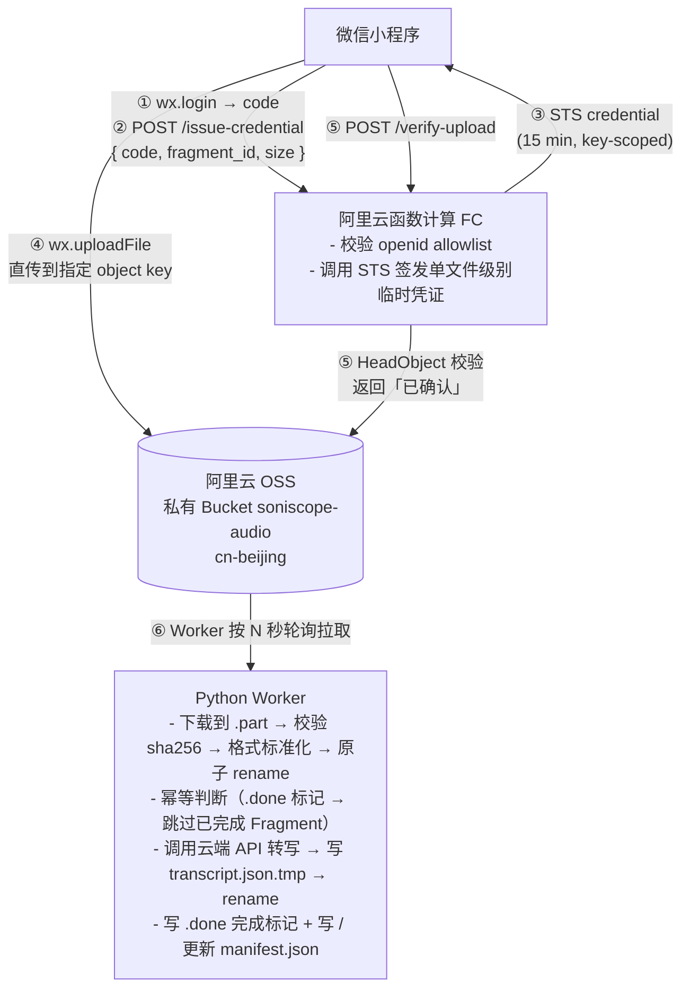
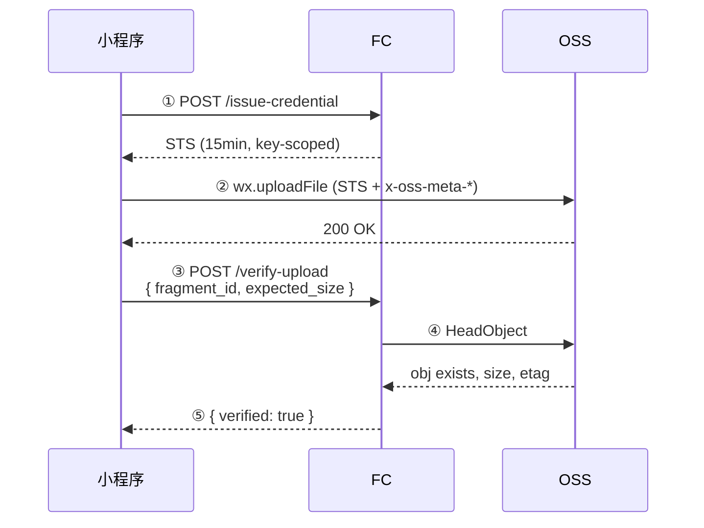
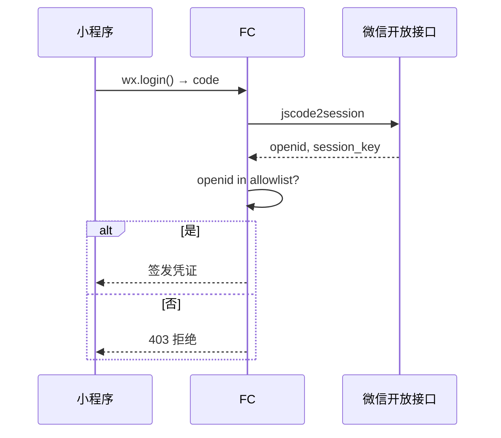
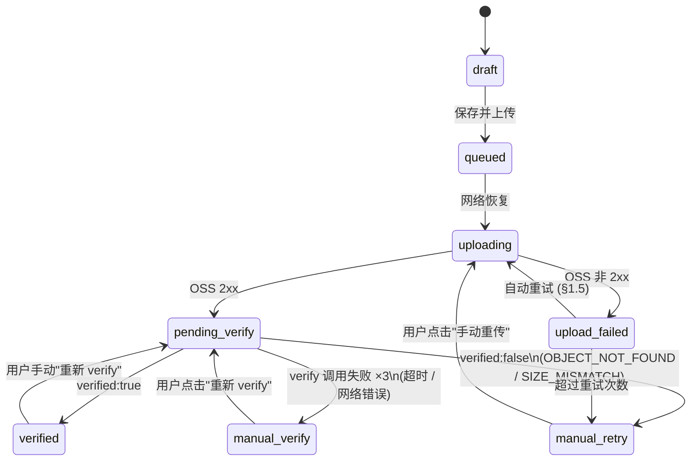

# 日观声记 · 技术设计文档（Tech Spec）

> **本文档是所有技术实现细节的唯一权威来源。** PRD（`docs/PRD_v1.md`）定义产品需求和 User Story 级别的验收标准；技术实现冲突以本文档为准，产品需求冲突以 PRD 为准。
>
> 更新技术方案（如换转写服务商、改文件协议、调整 API 格式）时，**只需修改本文档**。PRD 中的 User Story 引用本文档的章节号。

---

## 1. 系统架构

### 1.1 四层架构

| 层 | 组件 | 职责 |
|---|---|---|
| 手机端 | 微信小程序 | 录音、中断保护、草稿管理、本地缓存、调用 FC（静默登录 + 拿临时凭证）、直传音频到 OSS、调用 FC 验证上传、上传列表呈现 |
| 云端（无服务器） | 阿里云函数计算 FC 3.0（两个顶级 Web 函数，无 service 层级） | 校验 openid → 为指定 Fragment 签发**单文件级别**的 STS 临时凭证；提供 `/verify-upload` 接口对 OSS 做 HeadObject 校验 |
| 云端（存储） | 阿里云 OSS（私有 Bucket：`soniscope-audio`，region `cn-beijing`）| 静默存储音频文件，无计算能力；作为长期备份 |
| 后端 | Python Worker | 可配置频率轮询 OSS → 下载 → 格式标准化 → 幂等去重 → 调用云端 API 转写 → 按文件状态机落盘 |

### 1.2 架构图



### 1.3 设计原则

- **极薄前端 + 重后端**：业务规则（鉴权、签发、校验、转写、幂等）都在后端，小程序只做采集、上传、状态展示。小程序代码里**绝对不能**出现长期 AccessKey、任何业务密钥。
- **OSS object 是唯一数据契约**：连接小程序 → FC → Worker 三方。音频本体为 object body，前端生成的元数据（`session_id` / `chunk_seq` / `chunk_total` / `recorded_at` / `duration_seconds`）通过 OSS **用户自定义元数据（x-oss-meta-*）** 附带在同一 PutObject 请求中，Worker 通过 HeadObject 读回（见 §3.2、ADR-8）。
- **状态机以硬盘真实文件为权威**：本地用 `manifest.json` + `.part` / `.tmp` / `.done` 旗标，不引入数据库（本期）；冲突时以"硬盘上实际有什么文件"为准，代码不能假设"我记得我做过 X"。

### 1.4 数据可靠性闭环

**手机端**：先落盘 → 排队上传 → 上传成功并经 FC verify → 本地仍保留一定时间（保留时长见 PRD FR-8）→ 最终清理。中断事件自动 stop 并保存草稿。上传失败 3 次切换人工。

**云端**：OSS 私有 Bucket，永久保留，不删除。FC `/verify-upload` 给小程序最终签收回执。

**本地**：文件状态机 + 幂等判断（§3.5 / §3.6）保证 Worker 重启、转写中断后仍能正确恢复。

### 1.5 错误处理与重试策略

所有网络调用遵循统一的重试规则：

| 错误类型 | 策略 | 适用场景 |
|---|---|---|
| 网络错误 / 5xx | 指数退避自动重试 3 次（间隔 5s → 15s → 45s） | 小程序上传 OSS、小程序调 FC verify、Worker 调云端 ASR |
| 4xx（鉴权 / 配额 / 参数错误） | **立即失败**，不重试，打印明确错误码 | 所有场景 |
| 设备离线（小程序侧） | 切换为「待上传（离线排队）」，恢复网络后自动开始上传 | 小程序上传 OSS |
| 上传自动重试 3 次仍失败（小程序侧） | 切换为「待人工重传」红色提示 | 小程序上传 OSS |
| verify 调用自动重试 3 次仍失败（小程序侧） | 切换为「待人工 verify」红色提示 | 小程序调 FC verify |
| 下载失败（Worker 侧） | 删除 `.part`，下一轮轮询周期自动重下 | Worker 轮询下载 |

---

## 2. 仓库结构与运行环境

### 2.1 Monorepo 结构

```
my_soniscope/
├── apps/
│   ├── miniprogram/            # 微信小程序前端
│   ├── fc/<function>/          # 阿里云函数计算函数源码
│   └── worker/                 # Python Worker（包名 soniscope-worker）
├── scripts/                    # 跨组件运维与验证脚本
├── tests/
│   └── audio/                  # 共享测试音频 fixture
├── docs/
│   ├── PRD_v1.md               # 产品需求（WHAT + WHY）
│   ├── tech-spec.md            # 本文档：技术设计（HOW）
│   └── runbook/                # 人工准备登记表
├── pyproject.toml              # 根 uv workspace（不装业务依赖）
├── Makefile                    # 唯一命令入口
└── AGENTS.md
```

**关键约定**：

1. Python 用 uv workspace 管理；Worker 包名 `soniscope-worker`，CLI 入口 `python -m soniscope_worker`。
2. 代码仓库与 Worker 运行时目录分离：运行时数据由 `$SONISCOPE_HOME` 指定。
3. 顶层 Makefile 提供统一命令入口，用户无需进入子目录。
4. 本期不抽共享 Python 包；FC 与 Worker 如有重复逻辑各自保留。
5. 构建产物落 `build/`，已 gitignore。
6. **FC 3.0 命名**：阿里云侧函数是顶级 Web 函数，**没有 service 层级**；云端函数名 / URL 子域名前缀用 kebab-case（`issue-credential` / `verify-upload`）。代码目录可保留 snake_case（如 `apps/fc/issue_credential/`），但 `make deploy-fc FUNCTION=` / `make rollback-fc FUNCTION=` / `make fc-logs FUNCTION=` 以云端函数名为准（kebab-case）。
7. **Worker 模块清单**（`apps/worker/src/soniscope_worker/`）：`__init__.py` / `__main__.py` / `cli.py` / `config.py` / `paths.py`（后续 story 按需扩展）。

### 2.2 运行时数据目录

```
/Volumes/Data/software/SoniScope/        # $SONISCOPE_HOME（本项目实际值）
├── inbox/                                # 临时下载区
│   ├── <fragment_id>.part                # 下载中
│   └── failed/                           # 转码失败留档（不参与轮询重试）
│       └── <fragment_id>.wav.tmp
├── fragments/
│   └── <YYYY-MM-DD>/
│       └── <fragment_id>/
│           ├── audio.wav                 # 标准化 WAV 音频（下载/转码完成后原子写入）
│           ├── manifest.json             # 元数据（权威）
│           ├── transcript.json           # 结构化转写结果
│           ├── transcript.txt            # 纯文本（从 transcript.json 派生）
│           └── .done                     # 完成标记（最后写入）
├── tmp/                                  # 转写工作区
│   └── <fragment_id>.transcript.json.tmp
└── config.yaml                           # 脚本配置（轮询周期、模型选择等）
```

### 2.3 配置 Schema（`config.yaml`）

```yaml
oss:
  endpoint: oss-cn-beijing.aliyuncs.com
  bucket: soniscope-audio
  access_key_id: <soniscope-local-reader 的 AK ID>
  access_key_secret: <soniscope-local-reader 的 AK Secret>
poll:
  interval_seconds: 60
transcriber:
  name: cloud-speech              # 工厂方法选择：cloud-speech | whisper-local
  provider: aliyun-nls
  model: "中文普通话（识音石 V1 - 端到端模型)"
  params_version: v1
  api_endpoint: cn-beijing
  appkey: <NLS AppKey>
  access_key_id: <调用 NLS 的 AK>
  access_key_secret: <调用 NLS 的 AK Secret>
  upload_mode: oss-url            # oss-url | direct（见 §5.2）
  local:
    enabled: false                # whisper-local 子配置开关，不参与工厂选择（工厂只看 name）
```

**加载顺序**：① `$SONISCOPE_HOME/config.yaml` → ② `~/SoniScope/config.yaml`（未设置 `SONISCOPE_HOME` 时的兜底默认）。本项目实际 `SONISCOPE_HOME=/Volumes/Data/software/SoniScope`，因此实际配置文件为 `/Volumes/Data/software/SoniScope/config.yaml`；找不到时报错并提示用户参考 PRD US-001 (H)。

用 Pydantic v2 定义 `SoniScopeConfig` 模型。敏感字段（`access_key_secret` / `appkey` / `api_key`）在 `__repr__` / 日志中只显示前后 4 位。缺失必填字段时一次性列出所有缺失项。

**安全要求**：`config.yaml` 包含明文 AK，文件权限**必须**为 `chmod 600`（仅当前用户可读写）。`make check-config` 启动时检查权限，非 600 则警告。

---

## 3. 数据模型

### 3.1 Fragment ID 格式

```
<YYYYMMDDTHHMMSS>_<deviceShortId>_<ulid>
```

示例：`20260526T144800_dev01_01HZX3K8MN5PQR9TFB7AYWVCDE`

| 组成 | 说明 |
|---|---|
| `YYYYMMDDTHHMMSS` | 录音开始时间（本地时区），便于人眼可读、可按目录归档 |
| `deviceShortId` | 设备短 ID（小程序首次启动时生成 4-8 字符，持久化在本地）。**命名约定**：Fragment ID 字符串中用 camelCase `deviceShortId`；manifest.json 字段用 snake_case `device_id`；Python 代码中用 snake_case `device_short_id` |
| `ulid` | 26 字符 ULID（含毫秒精度时间戳 + 随机性，单调递增、防碰撞） |

**长录音分片**：超过分片阈值时前端自动分片，整段共享一个 `session_id`（ULID），每片独立 `fragment_id`，`chunk_seq` 从 1 递增。

**分片阈值**：前端常量 `CHUNK_MAX_DURATION_SECONDS = 600`（10 分钟），定义在小程序配置文件中。本期作为前端常量管理，不通过后端下发；如需调整，修改常量并重新发布小程序即可。

### 3.2 OSS Object Key 规则 + 用户自定义元数据

**Key**：
```
recordings/<YYYY-MM-DD>/<fragment_id>.wav
```

**用户自定义元数据（随 PutObject 一起写入）**：

| OSS meta key | 值 | 来源 |
|---|---|---|
| `x-oss-meta-session-id` | ULID | 前端 US-011 |
| `x-oss-meta-chunk-seq` | 整数（从 1 开始） | 前端 US-010/011 |
| `x-oss-meta-chunk-total` | 整数 或 `0`（非分片时） | 前端 US-010/011 |
| `x-oss-meta-recorded-at` | ISO 8601 带时区 | 前端 US-011 |
| `x-oss-meta-duration` | 秒数（浮点字符串） | 前端 US-011 |
| `x-oss-meta-original-format` | 原始音频格式字符串，如 `wav` / `mp3` / `aac` / `m4a` / `amr` 等 | 前端 US-007 |
| `x-oss-meta-sha256` | hex 编码的 sha256 | 前端 US-011 |

> Worker 通过 `client.head_object()`（alibabacloud-oss-v2）读取这些 meta，写入 `manifest.json` 对应字段。`chunk_total=0` 表示非分片单条录音，manifest 中存为 `null`。`x-oss-meta-sha256` 对应 `upload.original_sha256`（前端计算的原始字节 hash）。`oss:PutObject` 权限天然允许同请求写入用户自定义元数据，无需额外 STS policy 调整。

### 3.3 `manifest.json` Schema

每个 Fragment 目录下的 `manifest.json` 是该 Fragment 的**唯一权威状态来源**。

**字段来源**：`fragment_id` / `device_id` 由 Worker 从 object key 中的 fragment_id 解析；`session_id` / `chunk_seq` / `chunk_total` / `recorded_at` / `duration_seconds` / `audio.original_format` 由 Worker 从 OSS 用户自定义元数据读取（见 §3.2）；`upload.original_sha256` 由 Worker 从 `x-oss-meta-sha256` 读取（前端计算的原始字节 hash）；`audio.*`（sha256/format/size_bytes）由 Worker 本地计算（标准化后的最终 WAV 文件）；`upload.original_size_bytes` / `transcription.*` 由 Worker 在对应流程中填入。

```json
{
  "fragment_id": "20260526T144800_dev01_01HZX3K8MN5PQR9TFB7AYWVCDE",
  "session_id": "01HZX3K8MN5PQR9TFB7AYWVCDE",
  "chunk_seq": 1,
  "chunk_total": null,          // 非分片单条录音时为 null；长录音分片时为该 session 的总片数（整数）
  "device_id": "dev01",
  "recorded_at": "2026-05-26T14:48:00+08:00",
  "duration_seconds": 87.5,

  "audio": {
    "format": "wav",
    "original_format": "mp3",
    "size_bytes": 1234567,
    "sha256": "abc123..."
  },

  "upload": {
    "uploaded_at": "2026-05-26T14:48:30+08:00",
    "verified_at": "2026-05-26T14:48:32+08:00",
    "verify_method": "fc-head-object",
    "original_sha256": "abc123...",
    "original_size_bytes": 1234567
  },

  "transcription": {
    "started_at": "2026-05-26T14:49:00+08:00",
    "completed_at": "2026-05-26T14:49:12+08:00",
    "elapsed_seconds": 12.3,
    "transcriber": "cloud-speech",
    "model": "中文普通话（识音石 V1 - 端到端模型)",
    "params_version": "v1",
    "provider": "aliyun-nls",
    "upload_mode": "oss-url"
  }
}
```

**SHA256 一致性规则**：
- 当 `audio.original_format == 'wav'` 且 Worker 判定可直通（无需转码 / 重封装）：`audio.sha256 == upload.original_sha256`，`audio.size_bytes == upload.original_size_bytes`
- 当 `audio.original_format != 'wav'`，或 WAV 需要重封装/重采样才能满足本地标准：`audio.sha256` 通常不同于 `upload.original_sha256`；两者都必须真实计算，不允许留 null

### 3.4 `transcript.json` 结构

```json
{
  "segments": [
    { "start": 0.0, "end": 2.5, "text": "今天天气不错" },
    { "start": 2.5, "end": 5.1, "text": "我准备去公园跑步" }
  ],
  "language": "zh",
  "model": "中文普通话（识音石 V1 - 端到端模型)",
  "params_version": "v1",
  "provider": "aliyun-nls"
}
```

`transcript.txt` 从 `transcript.json` 派生（拼接 `segments[].text`），便于人眼直接读。

> **注**：`TranscriptResult` 内存 dataclass 额外含 `duration` 字段（音频总时长），但**不落盘**到 `transcript.json`——音频时长已记录在 `manifest.json` 的 `duration_seconds` 中，不重复存储。

### 3.5 文件状态机（三段式协议）

所有文件操作遵循**先临时、后原子 rename、最后写完成标记**的三段式协议：

| 阶段 | 中间态文件（位置） | 完成态文件（位置） | 失败/中断的后果 |
|---|---|---|---|
| 下载 | `inbox/<fragment_id>.part` | `fragments/<date>/<id>/audio.wav` | `.part` 残留在 `inbox/`，下次轮询重下 |
| 下载-转码（非 WAV 路径） | `inbox/<fragment_id>.wav.tmp` | 同上 `audio.wav` | `.wav.tmp` 残留在 `inbox/`，视为转码中断，下次重下重转码 |
| 转写 | `tmp/<fragment_id>.transcript.json.tmp` | `fragments/<date>/<id>/transcript.json` | `.tmp` 残留在 `tmp/`，下次启动清理并重新转写 |
| 完成 | — | `fragments/<date>/<id>/.done` | 无 `.done` 意味着流程未完整结束，需重做 |

> **关键约束**：`tmp/` 与 `fragments/` 必须位于同一文件系统，以保证 rename 操作的原子性。`inbox/` 同理。

**完成态定义**：当且仅当 `.done` 文件存在时，认为该 Fragment 已完整处理。

### 3.6 启动恢复扫描

Worker 启动时分三段扫描，按 §3.5 中间态文件的实际位置处理残留：

**第一段：扫描 `inbox/`（下载中断恢复）**

| 文件 | 判定 | 动作 |
|---|---|---|
| `<fragment_id>.part` | 下载中断 | 删除 `.part`，下次轮询重下 |
| `<fragment_id>.wav.tmp` | 转码中断 | 删除 `.wav.tmp`，下次轮询重下重转码。如果是转码错误（非中断），移到 `inbox/failed/` 留档（不再重试） |

**第二段：扫描 `tmp/`（转写中断恢复）**

| 文件 | 判定 | 动作 |
|---|---|---|
| `<fragment_id>.transcript.json.tmp` | 转写中断 | 删除 `.tmp`，对应 fragment 将在第三段被识别为"转写未完" |

**第三段：扫描 `fragments/**/`（fragment 状态判定）**

| 目录内容 | 判定 | 动作 |
|---|---|---|
| 有 `.done` | 已完成 | 跳过 |
| 无 `.done`，有 `audio.wav` | 转写未完 | 进入转写流程 |
| 无 `audio.wav` | 空目录（下载尚未完成或目录为人工创建的残留） | 可安全删除空目录，或忽略等待下次 OSS 轮询下载 |

### 3.7 幂等与重转

**正常轮询**：以 `.done` 标记为准。`.done` 存在即跳过，**无论**当前配置中的模型 / 参数版本是否与 manifest 中记录的一致。

**转写元数据四元组**（记录于 manifest，供溯源和 CLI 筛选，不参与自动跳过判断）：
```
(audio_sha256, transcriber_name, model_version, params_version)
```

**显式重转 CLI**（完整签名）：

```
python -m soniscope_worker retranscribe <fragment_id> [--all-from <YYYY-MM-DD>] [--upgrade] [--force]
```

| flag | 行为 |
|---|---|
| （无 flag） | 若 `.done` 存在 → 提示"已完成，使用 --force 或 --upgrade" |
| `--upgrade` | 比对 manifest 中 `model` / `params_version` 与当前配置，仅对旧版本执行重转 |
| `--force` | 忽略一切判断，直接重转 |
| `--all-from <date>` | 按目录批扫描，逐条转写，遇到失败继续下一条并最后汇总 |

顶层 `make` 别名见 §6.5（`make retranscribe`）。运行期间 Worker 主轮询线程可继续（不互斥），但同一 `fragment_id` 不会被同时转两遍（用 file lock 防并发）。

---

## 4. API 协议

### 4.0 FC 运行时环境变量

FC 函数运行时依赖以下环境变量（在 FC 控制台 → 服务配置中注入，US-001(H) 人工准备）：

| 变量名 | 说明 | 示例 / 备注 |
|---|---|---|
| `OSS_BUCKET` | OSS Bucket 名 | `soniscope-audio` |
| `OSS_REGION` | Bucket 所在 region | `cn-beijing` |
| `OSS_ENDPOINT` | OSS endpoint | `oss-cn-beijing.aliyuncs.com` |
| `RAM_ROLE_ARN` | STS AssumeRole 的角色 ARN | `acs:ram::1633875501759333:role/soniscope-uploader-role` |
| `ALIYUN_AK_ID` | FC 子账号 `soniscope-fc` 的 AK ID | — |
| `ALIYUN_AK_SECRET` | FC 子账号 `soniscope-fc` 的 AK Secret | — |
| `WX_APPID` | 微信小程序 AppID | — |
| `WX_APP_SECRET` | 微信小程序 AppSecret | — |
| `OPENID_ALLOWLIST` | 允许访问的 openid 列表（逗号分隔） | 单用户填 1 个 |
| `MAX_UPLOAD_BYTES` | 上传大小上限（可选，默认 52428800 = 50MB） | §4.1 使用 |

> PRD US-001(H) 负责定义人工注入流程，本表是变量名与语义的**唯一权威定义**。
>
> FC 3.0 实际公网 URL 以 runbook 为准：`issue-credential` = `https://issue-cedential-ottfirocds.cn-beijing.fcapp.run`；`verify-upload` = `https://verify-upload-nnjpaoamhw.cn-beijing.fcapp.run`。微信小程序 `request` 合法域名必须分别加入这两个 URL；`uploadFile` 合法域名为 `https://soniscope-audio.oss-cn-beijing.aliyuncs.com`。

### 4.1 FC `/issue-credential`

**请求**：`POST /issue-credential`

```json
{ "code": "<wx.login code>", "fragment_id": "<id>", "size": 1234567 }
```

> **注**：sha256 不在 FC 请求中传递——HeadObject 无法校验 sha256（OSS ETag 是 MD5），sha256 完整性校验由离线脚本 `make verify-e2e-sha256` 负责。前端算出的 sha256 通过 OSS 用户自定义元数据 `x-oss-meta-sha256` 传递给 Worker（见 §3.2）。

**鉴权流程**：
1. 用 `code` 调 `jscode2session` 换 `openid`；失败返回 `401 { "error": "INVALID_CODE" }`
2. 检查 `openid` 是否在 `OPENID_ALLOWLIST` 环境变量中；不在返回 `403 { "error": "OPENID_NOT_ALLOWED" }`
3. 检查 `size ≤ MAX_UPLOAD_BYTES`（默认 52428800 = 50MB）；超过返回 `400 { "error": "SIZE_EXCEEDED", "limit_bytes": 52428800, "actual_bytes": <size> }`

**STS 签发**：
- 目标 object key：`recordings/<YYYY-MM-DD>/<fragment_id>.wav`
- Policy Resource **精确等于** `acs:oss:*:*:<bucket>/<object_key>`（单条，不带通配符）
- 有效期 ≤ 900 秒（15 分钟）

**成功响应**：
```json
{
  "access_key_id": "...",
  "access_key_secret": "...",
  "security_token": "...",
  "expiration": "2026-05-26T15:03:00Z",
  "bucket": "soniscope-audio",
  "endpoint": "oss-cn-beijing.aliyuncs.com",
  "object_key": "recordings/2026-05-26/20260526T144800_dev01_01HZX3K8MN5PQR9TFB7AYWVCDE.wav"
}
```

P95 响应时间目标见 PRD §9 P-02。

### 4.2 FC `/verify-upload`

**请求**：`POST /verify-upload`

```json
{ "code": "<wx.login code>", "fragment_id": "<id>", "expected_size": 1234567 }
```

> **注**：`expected_sha256` 已从请求中移除——HeadObject 只能校验 size（Content-Length），无法校验 sha256。sha256 完整性校验由离线脚本负责。

**鉴权**：同 §4.1（openid + allowlist）。

**校验逻辑**（HeadObject）：

| OSS 状态 | 响应 |
|---|---|
| 对象不存在 | `{ "verified": false, "reason": "OBJECT_NOT_FOUND" }` |
| 存在但 Content-Length 不一致 | `{ "verified": false, "reason": "SIZE_MISMATCH", "actual_size": ... }` |
| 存在且大小一致 | `{ "verified": true, "etag": "...", "size": ..., "last_modified": "..." }` |

P95 响应时间目标见 PRD §9 P-03。

### 4.3 上传确认协议（端到端时序）



### 4.4 STS 单文件级授权（Policy 模板）

```json
{
  "Version": "1",
  "Statement": [
    {
      "Effect": "Allow",
      "Action": ["oss:PutObject"],
      "Resource": [
        "acs:oss:*:*:soniscope-audio/recordings/2026-05-26/20260526T144800_dev01_01HZX3K8MN5PQR9TFB7AYWVCDE.wav"
      ]
    }
  ]
}
```

拿到这份临时凭证只能上传这一个文件。不能列 Bucket、不能读其他文件、不能上传到别的 key。凭证 15 分钟过期。`oss:PutObject` 权限天然允许同请求写入用户自定义元数据（`x-oss-meta-*`），无需额外 Action（见 §3.2 meta 清单）。

### 4.5 FC 鉴权流程（openid + allowlist）



本期 allowlist 在 FC 环境变量 `OPENID_ALLOWLIST` 中硬编码（逗号分隔）。

---

## 5. 音频处理

### 5.1 格式策略（前端保留原始格式 + Worker 统一标准化为 WAV）

- 前端不做音频转码；录音时可优先请求体积较小、平台兼容性较好的格式（如 `mp3`），但必须以微信实际产出的文件为准
- 若微信返回 AAC/M4A、MP3、WAV、AMR 或其他可用格式，前端均按原样保存并上传；不得在小程序端转码
- 不论原始格式是什么，manifest 中都必须标注 `audio.original_format`；OSS object key 始终用 `.wav` 扩展名，表示 Worker 侧最终标准化目标
- **Worker 负责格式标准化**：下载后用 `ffprobe` 检测真实格式；合规 WAV 可直通或无损重封装，任意非 WAV 格式用 `ffmpeg` 转码为 WAV
- 转码失败时移到 `inbox/failed/` 留档，不污染 `fragments/` 目录

### 5.2 转写策略（OSS 签名 URL vs 直传）

- **方案 A（首选）**：生成 OSS 临时签名 URL（有效期 1 小时），传给 NLS API 让其自行拉取。传给 NLS 的是 OSS 上的**原始 object**（可能不是 WAV）；Worker 本地仍然必须完成 `audio.wav` 标准化落盘
- **方案 B（降级）**：当 `config.yaml` 中 `transcriber.upload_mode = 'direct'`、或 provider 不支持 URL 拉取原始 object 时，Worker 把本地标准化后的 `audio.wav` 通过 multipart 上传给 API
- 签名 URL 过期处理：NLS 异步轮询超过 50 分钟时重新签发
- 日志中打印 `mode=oss-url` / `mode=direct-upload`

### 5.3 Transcriber 接口设计

#### 抽象接口

```python
class Transcriber(Protocol):
    def transcribe(
        self,
        fragment_id: str,
        audio_path: Path,
        oss_key: str,
    ) -> TranscriptResult: ...
```

#### TranscriptResult

```python
@dataclass
class TranscriptResult:
    segments: list[Segment]   # [{"start": float, "end": float, "text": str}, ...]
    language: str              # e.g. "zh"
    model: str                 # e.g. "中文普通话（识音石 V1 - 端到端模型)"
    params_version: str        # e.g. "v1"
    provider: str              # e.g. "aliyun-nls"
    duration: float            # 音频总时长（秒）；仅内存使用，不落盘到 transcript.json
```

> `duration` 不写入 `transcript.json`——音频时长已记录在 `manifest.json` 的 `duration_seconds` 中，避免重复存储。

#### 工厂方法

根据 `config.yaml` 的 `transcriber.name`（§2.3）分发：

| `transcriber.name` | 实现类 | 说明 |
|---|---|---|
| `cloud-speech` | `CloudSpeechTranscriber` | 调用云端 ASR API（§5.2 签名 URL vs 直传） |
| `whisper-local` | `WhisperLocalTranscriber` | 占位骨架，`raise NotImplementedError`；本期不实现 |

切换 provider 只改 `config.yaml`，不改业务代码。

---

## 6. 技术约束与依赖

### 6.1 平台约束

- **微信小程序**：单条录音目标 ≤ 分片阈值（§3.1）；`wx.uploadFile` 单文件大小有限制，超长录音前端分片
- **小程序故障注入开关**（仅 `NODE_ENV != 'production'` 可见，运行时切换无需改源码）：

  | 开关名 | 效果 | 验证场景 |
  |---|---|---|
  | `mock-fc-url-broken` | 所有 FC 请求强制返回失败 | US-014 重试 3 次 → 待人工重传 |
  | `mock-network-offline` | 模拟离线（即使真实网络通畅） | US-014 离线排队 → 恢复上传 |
  | `mock-verify-fail` | `/verify-upload` 永远返回 `verified: false` | US-013 verify 失败 → 待人工 verify |

- **OSS 直传**：必须使用 STS 临时凭证 + V4 签名直传，不走 FC 中转
- **Worker 运行环境**：当前验证主机为 Mac Studio M4 Max（macOS 26.5，Python 3.13.2，`SONISCOPE_HOME=/Volumes/Data/software/SoniScope`，可用磁盘 2.38TB）；代码仍要求 Python 3.11+，无 GPU 要求（本期不做本地推理）；`$SONISCOPE_HOME` 所在磁盘可用空间 ≥ 50GB（音频积压 + 转写文件长期保留预留）；系统工具依赖 `git` / `make` / `curl` / `ffmpeg` / `ffprobe`
- **音频 sha256**：前端用 wasm-crypto 或类似库计算，避免主线程阻塞
- **小程序 SDK 接口约定**：

  | 功能 | API |
  |---|---|
  | 录音 | `wx.getRecorderManager()` → `.start()` / `.stop()` / `.onStop()` / `.onInterruptionBegin()` |
  | 音频播放 | `wx.createInnerAudioContext()` |
  | 本地持久化 | `wx.setStorageSync()` / `wx.getStorageSync()` |
  | 静默登录 | `wx.login()` |
  | 直传 OSS | `wx.uploadFile()` |
  | sha256 | `wasm-crypto` 或同类 wasm 库（避免主线程阻塞） |

### 6.2 云端 ASR 选型

本项目实际选用**阿里云智能语音交互 NLS**（项目 `soniscope`，endpoint `cn-beijing`，模型 `中文普通话（识音石 V1 - 端到端模型)`，无免费额度）。理由：与 OSS 同账号 / 同 region（北京）便于权限与链路管理 / 支持 OSS URL 拉取。备选：OpenAI Whisper API、通义听悟。

### 6.3 依赖清单

| 组件 | 依赖 |
|---|---|
| 小程序 | `miniprogram-recorder-manager`（系统 API）、`wasm-crypto`（可选，前端 sha256） |
| FC（Python） | `alibabacloud-sts20150401`、`alibabacloud-oss-v2`(HeadObject 校验用) |
| FC 部署（Python） | `alibabacloud-fc20230330`（`make deploy-fc` 脚本用，不随函数打包） |
| Worker（Python） | `alibabacloud-oss-v2`、`pyyaml`、`pydantic>=2`、`typer`、`alibabacloud-nls20180628`；**本期不装** `faster-whisper` / `whisper.cpp` |
| Worker（系统二进制） | `ffmpeg` + `ffprobe`（各种音频格式 → WAV 转码 + 格式检测）；缺失则启动失败并提示安装方式 |

### 6.3.1 测试基线音频素材

测试音频二进制**不进 git**，存于 OSS 私有 Bucket `soniscope-audio` 的 `sample/` 前缀；本地通过 `python3 scripts/fetch_test_fixtures.py` 按 sha256 拉取到 `tests/audio/`，清单为 `tests/audio/fixtures.manifest.json`。sha256 以 runbook §6 为准：

| 文件 | 期望 duration | 期望 codec | sha256 |
|---|---|---|---|
| `sample-20s.wav` | ≈ 20s | wav | `b07dee76f9cab9cf4ed9ba482e7a6287409180fc05e476365bd9a92f665b7828` |
| `sample-54s.wav` | ≈ 60s | wav | `9c454b212654f8948557123d9bc16d78ea6b2cf425484fca195b60fe9c7c9cde` |
| `sample-25min.wav` | ≈ 1500s | wav | `34db505eb44f93fd092e868664979c155ebbbb6c0a61019dd840b30d276cdb27` |
| `sample-20s.m4a` | ≈ 20s | m4a | `d3d2866128efe258ff95e841a16e7abb4d783fd37536692932a875f9fb5380fd` |

### 6.4 FC 部署与运维

**FC 形态**：本项目使用 FC 3.0 顶级 Web 函数，**不创建 / 不依赖 `soniscope-svc` service 层级**。实际云端函数名为 `issue-credential`、`verify-upload`，分别有独立的 `*.cn-beijing.fcapp.run` 公网 URL。

**打包**：`make deploy-fc` 脚本为每个 FC 函数独立打包（`handler.py` + 依赖）→ 上传至阿里云 FC 3.0 对应顶级函数。打包产物落 `build/fc/<function_name>/`。

**备份**：部署前自动备份当前线上版本到 `build/fc/backup/<YYYYMMDD-HHMMSS>/<function_name>.zip`，含函数代码 + 环境变量快照（仅变量名，不含值）。

**部署日志**：每次部署写入 `build/fc/logs/deploy-<YYYYMMDD-HHMMSS>.log`，包含函数名、zip sha256、上传耗时、curl 存活验证结果。

**回滚**：`make rollback-fc FUNCTION=<name>` 从最新备份恢复指定函数。

**日志**：FC 运行时日志接入阿里云日志服务（SLS），`make fc-logs FUNCTION=<name>` 快捷查看近 1 小时日志。

**部署期环境变量**：

| 变量名 | 说明 | 注入方式 |
|---|---|---|
| `ALIYUN_DEPLOY_AK_ID` | FC 部署脚本使用的 AK ID（`soniscope-fc-deploy` 子账号或同 `soniscope-fc`） | 本地 `.env`（已 gitignore）或 CI secret |
| `ALIYUN_DEPLOY_AK_SECRET` | 对应 AK Secret | 同上 |

> 部署期变量与运行时变量（§4.0）分开管理：运行时变量在 FC 控制台注入，部署期变量在开发者本地 / CI 环境注入，**均不写死到代码里**。

**依赖隔离**：`alibabacloud-fc20230330` 仅用于部署脚本，不随函数代码打包上传。

### 6.5 `make` 命令接口清单

本表是**核心 `make` target 清单**。各 story 专用的 `test-*` target 按约定式命名（`test-<功能点>`）随实现逐步添加，不逐一列出。PRD 中引用 `make` 命令时以本表为准。

| target | 参数 | 用途 | 引入 story |
|---|---|---|---|
| `install` | — | `uv sync`，安装所有 Python 依赖 | US-002 |
| `verify-prep` | — | 一键校验 US-001 全部人工准备产物 | US-002 |
| `check-config` | — | 读取 config.yaml → 打印脱敏摘要 → 校验必填字段 | US-002 |
| `init-dirs` | — | 创建 `$SONISCOPE_HOME` 下 `inbox/` / `fragments/` / `tmp/` | US-002 |
| `worker-run` | — | 启动 Worker 主轮询 | US-002 |
| `typecheck` | — | mypy strict | US-002 |
| `lint` | — | ruff | US-002 |
| `test` | — | pytest（单元测试，mock 云端） | US-002 |
| `deploy-fc` | `FUNCTION=<function-name>` | 打包 + 上传 FC 函数（见 §6.4；如 `issue-credential` / `verify-upload`） | US-003 |
| `rollback-fc` | `FUNCTION=<function-name>` | 从最新备份恢复 FC 函数（如 `issue-credential` / `verify-upload`） | US-003 |
| `fc-logs` | `FUNCTION=<function-name>` | 拉取近 1 小时 FC 日志（如 `issue-credential` / `verify-upload`） | US-003 |
| `test-fc-live` | — | FC 云端联调（正例 + 反例） | US-003 |
| `test-verify-upload` | — | FC `/verify-upload` 云端联调 | US-005 |
| `retranscribe` | `FRAGMENT_ID=<id>` 或 `ARGS="--all-from <date> --upgrade"` | 显式重转 CLI 入口（单条用 FRAGMENT_ID，批量用 ARGS） | US-018 |
| `simulate-worker-crash` | `CASE=<missing-done\|stale-part>` `FRAGMENT_ID=<id>` | Worker 崩溃场景模拟 | US-016 |
| `test-crash-recovery` | — | 下载中 kill -9 → 重启恢复验证 | US-016 |
| `test-sts-escape` | — | STS 单 key policy 越权验证 | US-012 |
| `test-e2e-crash-recovery` | — | E2E 崩溃恢复（3 种场景完整跑通） | §4.1 |
| `test-e2e-retranscribe` | — | E2E 显式重转验证 | §4.1 |
| `test-e2e-security` | — | E2E 鉴权 + 越权反例验证 | §4.1 |
| `test-*` | — | 各 story 专用自动验证（如 `test-wav-passthrough` / `test-audio-transcode-to-wav` / `test-idempotent-skip` / `test-transcribe` 等） | 各 story |
| `verify-e2e-integrity` | — | 验证 100 条 Fragment 目录完整性（5 个文件） | §4.1 |
| `verify-e2e-sha256` | — | sha256 完整性校验（规则见 §3.3）：OSS 侧 + 本地侧分路径校验 | §4.1 |
| `verify-e2e-fields` | — | manifest 关键字段非空校验 | §4.1 |
| `verify-no-stale` | — | 检查 `inbox/` / `tmp/` 无残留中间态文件 | §4.1 |
| `verify-oss-retention` | — | OSS 对象数 ≥ 本地 + 无 DeleteObject 日志 | §4.1 |
| `list-oss-objects` | `DATE=<YYYY-MM-DD>` | 列出指定日期 OSS 对象 + 计数 | §4.1 |
| `show-oss-object` | `FRAGMENT_ID=<id>` | 查看单个 OSS 对象详情 / 访问日志 | US-012 |
| `oss-delete-obj` | `FRAGMENT_ID=<id>` | **仅测试用**：删除 OSS 对象（模拟 verify 失败场景，见下方红线说明）| US-005 |

> 上述 target 随 story 实现逐步添加。`FUNCTION=` 参数统一使用云端函数名（kebab-case：`issue-credential` / `verify-upload`），见 §2.1 约定 6；如实现层代码目录用 snake_case，部署脚本负责映射。
>
> **红线说明**：「OSS 永不删除」约束的主体是 **Worker 业务路径**（PRD FR-11 / R-07）。测试 / 运维脚本（如 `oss-delete-obj`、`ossutil rm`）用于构造验证场景，不受此约束，但必须标注 `仅测试用` 且不出现在 Worker 源码中。

### 6.6 成本预估

| 项 | 月成本 |
|---|---|
| FC 调用（含 issue + verify）| 约 ¥1.00/月（按 runbook 当前调用规模估算） |
| STS 调用 | ¥0（免费）|
| OSS 存储（约 1.6GB WAV/月）| 约 ¥0.19/月 |
| OSS 外网流出（Worker 经外网下载约 1.6GB/月）| 约 ¥0.78/月 |
| 云端 ASR（日均 30 分钟 × 30 天 = 15 小时/月）| 2.5 元/小时 × 15 小时 = ¥37.50/月（无免费额度） |
| **合计** | **约 ¥39.47/月** |

### 6.7 前端上传状态机

每条 Fragment（或分片 chunk）在前端维护以下 8 种上传状态：



> 用户可见文案（中文）的权威定义在 PRD US-014。

| 状态 | 触发迁移 |
|---|---|
| `draft` | 点击"保存并上传" → `queued` |
| `queued` | 网络恢复 → `uploading` |
| `uploading` | OSS 2xx → `pending_verify`；非 2xx → `upload_failed` |
| `pending_verify` | `verified: true` → `verified`；`verified: false`（对象不一致）→ `manual_retry`；verify 调用失败 ×3（超时/网络）→ `manual_verify` |
| `verified` | 正常终态；用户可手动触发"重新 verify" → `pending_verify` |
| `upload_failed` | 自动重试（§1.5）→ `uploading`；超过重试次数 → `manual_retry` |
| `manual_retry` | 用户点击"手动重传" → `uploading` |
| `manual_verify` | 用户点击"重新 verify" → `pending_verify` |

> `verified` 是正常终态，仅用户手动触发"重新 verify"时可回到 `pending_verify`。本地缓存清理策略见 PRD FR-8；其他状态永不自动删除。

### 6.8 成本可观测日志

Worker 每次调用 ASR API 后输出结构化日志行，用于监控 ASR 用量与成本（当前 runbook 登记为无免费额度）：

```json
{
  "event": "asr_call_completed",
  "fragment_id": "<id>",
  "audio_duration_seconds": 87.5,
  "elapsed_seconds": 12.3,
  "provider": "aliyun-nls",
  "model": "中文普通话（识音石 V1 - 端到端模型)",
  "estimated_cost_yuan": 0.06,
  "cumulative_calls_today": 15,
  "cumulative_duration_today_seconds": 1200.0
}
```

| 字段 | 说明 |
|---|---|
| `audio_duration_seconds` | 音频时长（秒），用于按时长计费的 provider |
| `estimated_cost_yuan` | 单次预估成本（元），按 provider 费率计算 |
| `cumulative_calls_today` | 当日累计调用次数 |
| `cumulative_duration_today_seconds` | 当日累计音频时长（秒） |

> 累计值基于当日内存计数，Worker 重启后归零。仅用于运行时监控，不持久化。

---

## 7. 实施里程碑

| 里程碑 | 范围 | 完成标志 |
|---|---|---|
| **M0**（人工） | US-001：阿里云 + 微信 + ASR + 测试素材 + Worker 环境 + 凭证 | `make verify-prep` 全绿 |
| **M1**（AI） | US-002 + US-003 + US-005：骨架 + FC 部署联调 | `make typecheck && make lint && make test && make deploy-fc && make test-fc-live && make test-verify-upload` 全绿 |
| **M2**（AI + 真机） | US-007 ~ US-014：小程序完整"录音 → 上传 → verify" | DevTools + 真机两侧 verified；故障注入可用 |
| **M3**（AI + Worker） | US-015 ~ US-019：Worker 完整"轮询 → 下载 → 转写 → 落盘" | `make test` 通过 + 崩溃恢复场景全部成功 |
| **M4**（E2E） | §4 Feature 最终验收 AC | §4.1 自动脚本全绿 + §4.2 真机 checklist 全部打勾 |
| **下一阶段** | 本地 Whisper 替换云端 API | 切换 `transcriber.name` 配置即可 |

从 M1 开始，**用户不再回阿里云 / 微信任何控制台**。

---

## 8. 架构决策记录（ADR）

### ADR-1：小程序录音原始格式与 WAV 标准化（原 OQ-1）

- **背景**：`wx.getRecorderManager()` 在不同机型、系统和参数下可能产出 MP3、AAC/M4A、WAV、AMR 等不同格式；前端无法可靠保证所有设备都输出同一种格式。
- **决策**：前端保留微信实际产出的原始格式，不做转码；由 Worker 用 `ffprobe` 探测真实格式，并用 `ffmpeg` 将各种原始格式统一标准化为 WAV（合规 WAV 可直通或无损重封装）。
- **理由**：前端转码拖累电量与延迟；WAV 作为本地长期处理格式更利于后续分析和模型兼容；Worker 端集中转码便于测试、恢复和失败留档。
- **影响**：US-007 / US-015 / US-019 manifest schema / 依赖加 ffmpeg。

### ADR-2：前端 sha256 计算（原 OQ-2）

- **决策**：前端算 sha256；卡顿严重时再退化为 size-only verify。
- **理由**：sha256 是 FC verify 的关键信号；先按完整方案做。
- **后置触发**：低端 Android 出现 > 2s 卡顿时降级。

### ADR-3：单条 Fragment 强制重转 CLI（原 OQ-3）

- **决策**：本期提供 `retranscribe <id> --force` CLI + `--all-from` 批量。
- **理由**：单条调试 / 修复转写错误的高频需求，成本极低。

### ADR-4：长录音 chunk 上传列表展示（原 OQ-4）

- **决策**：折叠卡片聚合显示 + 每个 chunk 独立可重传。
- **理由**：聚合卡片保持"一段录音"感知；独立重传避免无谓重传已成功 chunk。

### ADR-5：FC 上传大小上限（原 OQ-5）

- **决策**：加 50 MB 上限，环境变量 `MAX_UPLOAD_BYTES` 可调。
- **理由**：单条目标 ≤ 10 分钟约 10 MB；50 MB 留 5x 余量。

### ADR-6：云端 ASR 选型（原 OQ-6）

- **决策**：按 runbook 选定阿里云智能语音交互 NLS；项目 `soniscope`，endpoint `cn-beijing`，模型 `中文普通话（识音石 V1 - 端到端模型)`，无免费额度。
- **理由**：同账号 / 同 region（北京）/ 支持 OSS URL 拉取；成本按 runbook 当前基线约 ¥39.47/月。

### ADR-7：NLS 拉 OSS URL vs Worker 直传（原 OQ-7）

- **决策**：默认方案 A（OSS 签名 URL）；不支持的 provider 降级方案 B。
- **理由**：省 Worker 上行流量；同 region 免外网费。
- **风险**：签名 URL 过期已在 US-017 AC 处理（50 分钟重签）。

### ADR-8（原 OQ-8）：前端元数据传输载体——OSS 用户自定义元数据

- **背景**：`manifest.json` 要求 Worker 落盘 `session_id` / `chunk_seq` / `chunk_total` / `recorded_at` / `duration_seconds` 等**只有前端才知道**的字段。架构原则规定"OSS object 是唯一数据契约"，但前端只上传音频本体（object key 使用 `.wav` 标准化目标扩展名），不上传 manifest，FC 请求体也不包含这些字段——Worker 物理上无法获取。
- **备选方案**：
  - **A. OSS 用户自定义元数据（x-oss-meta-*）**：前端在 `wx.uploadFile` 的 header 中附带 `x-oss-meta-session-id` 等字段，Worker 通过 `HeadObject` 读回。无需改 STS policy（`PutObject` 天然允许同请求写 meta）、不增加 object 数量。
  - **B. Sidecar 对象**：前端额外上传 `<fragment_id>.manifest.json` 到 OSS。需将 STS policy 从单 key 放宽到两个 key，增加上传步骤和原子性复杂度。
- **决策**：选 **方案 A**（OSS 用户自定义元数据）。
- **理由**：最小改动；不破坏"单文件 STS"的安全模型；不增加前端上传步骤和失败点；Worker 侧 `head_object()` 读取 meta 是 O(1) 轻量操作。
- **影响范围**：§1.3、§3.2、§3.3、§4.3、§4.4 已同步更新；PRD US-011/US-012/US-015 已同步更新。
