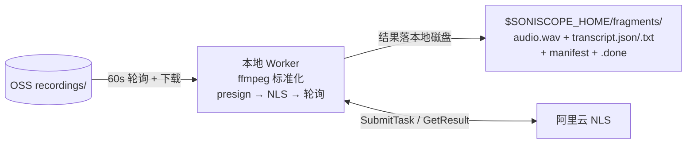
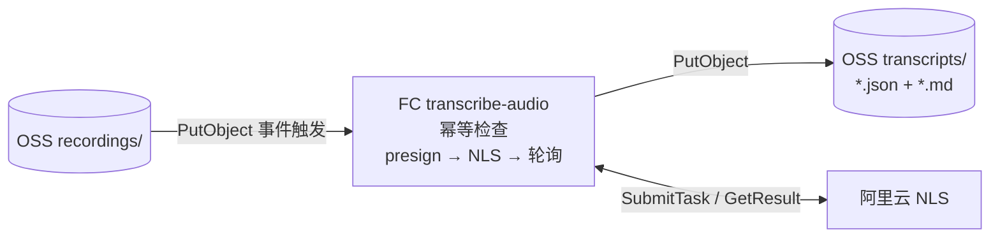

# 转写方案对比：本地 Worker 转写（现状） vs FC 直接转写 OSS 音频

> 状态：评审用对比文档。
>
> - 现状实现权威来源：`docs/tech-spec.md`（§1 架构、§5 音频处理、§6.6 成本）
> - FC 方案详细设计：`docs/fc-transcribe-design.md`
>
> **范围说明（先读）**：两个方案覆盖的职责范围不同。现状 Worker 做的是「下载 → ffmpeg 标准化 → 转写 → 本地状态机落盘」的完整流水线；FC 方案只覆盖其中「转写 → 产物落 OSS」一段。因此 FC 方案是**替代转写触发与执行位置**，而不是替代整个 Worker——本地音频归档（audio.wav / manifest / .done 状态机）如仍是产品需求，Worker 依然需要存在。

---

## 1. 两方案一句话

| 方案 | 一句话 |
|---|---|
| **方案一（现状）** | 本地 Mac 上的 Python Worker 按 60s 轮询 OSS，下载音频、ffmpeg 标准化后，presign 签名 URL 提交阿里云 NLS filetrans 转写，结果落盘到 `$SONISCOPE_HOME` 本地目录 |
| **方案二（FC 直转）** | OSS 上传事件直接触发 FC 函数 `transcribe-audio`，函数内 presign URL 提交 NLS，转写结果（json + md）写回 OSS `transcripts/` 前缀，全程无本地机器参与 |

两方案的 ASR 引擎相同（阿里云 NLS filetrans，OSS 签名 URL 拉取模式），**转写质量与 ASR 费用完全一致**，差异全部在触发方式、执行位置和产物落点。

---

## 2. 架构对比

### 方案一（现状）

### 方案二（FC 直转）

---

## 3. 逐维度对比

| 维度 | 方案一：本地 Worker（现状） | 方案二：FC 直转 | 优势方 |
|---|---|---|---|
| **触发方式** | 60s 轮询（`poll.interval_seconds`），空转也在跑 | OSS 事件推送，上传即触发，零空转 | 二 |
| **转写时延**（上传→出结果） | 轮询等待（平均 30s，最坏 60s）+ 下载 + 转码 + NLS 时间 | 事件触发（秒级）+ NLS 时间；省去下载/转码等待 | 二 |
| **可用性依赖** | 依赖本地 Mac 开机、在网、Worker 进程存活；机器关机则积压 | 全托管，无单机依赖；FC 可用性由阿里云 SLA 保障 | 二 |
| **断点恢复** | 已实现完整三段式状态机 + 启动恢复扫描（tech-spec §3.5/§3.6），成熟可靠 | 依赖 FC 异步重试 + 幂等检查（以 transcript md 存在为完成标记），机制更简单但同样闭环 | 平 |
| **产物形态** | 本地文件树：audio.wav（标准化 WAV）+ transcript.json/.txt + manifest.json + .done，**含音频本体归档** | OSS 上 transcripts/*.json + *.md，**只有文字，无本地音频归档** | 视需求 |
| **音频标准化** | 有（ffprobe 探测 + ffmpeg 转 WAV，失败留档 inbox/failed/） | 无也不需要（NLS 直接拉原始 object；但也意味着丢失「本地标准 WAV 长期归档」能力） | 视需求 |
| **消费便利性** | 结果在本地磁盘，本机后续分析零成本 | 结果在 OSS，任何端（小程序、Web、其他函数）都可直接读取；本机要用需再下载 | 视需求 |
| **小程序闭环潜力** | 无：小程序无法访问本地磁盘，看不到转写结果 | 有：小程序可通过 FC 签发只读凭证直接拉取 transcripts/*.md，为「录完即看文字」铺路 | 二 |
| **运维复杂度** | 需维护本地运行环境（Python、ffmpeg、SONISCOPE_HOME、磁盘 ≥50GB）、进程守护 | 需维护第三个 FC 函数 + OSS 触发器 + 新子账号 RAM 授权；无进程/主机运维 | 二（略） |
| **可观测性** | 本地 stdout 日志 + §6.8 成本日志，需登录本机查看 | FC 日志入 SLS，`make fc-logs` 可查；有调用次数/错误率云端指标 | 二 |
| **调试便利** | 本地断点、直接看中间文件，调试体验最好 | 云端调试靠日志，迭代需部署，反馈环更长 | 一 |
| **安全面** | 本地 config.yaml 持有明文 AK（chmod 600 约束） | 新增一个云上子账号；AK 存 FC 环境变量。攻击面从「个人电脑」移到「云控制台」 | 平 |
| **实施成本** | 零（已实现、已通过测试） | 一次性人工准备（子账号/函数/触发器）+ 新 handler 开发 + 联调测试；`fc_deploy.py` 只需 FUNCTIONS 加一项 | 一 |
| **对 tech-spec 的冲击** | 无 | 需增补 transcripts/ key 规则 + 新 ADR；如收敛 Worker 还需新 provider | 一 |

---

## 4. 成本对比（月度，按 tech-spec §6.6 基线：日均 30 分钟音频）

| 项 | 方案一（现状） | 方案二（FC 直转） |
|---|---|---|
| NLS ASR | ¥37.50 | ¥37.50（相同） |
| OSS 外网流出（Worker 下载音频） | ¥0.78 | ¥0（FC 同 region 内网；若 Worker 仍下载归档则此项保留） |
| FC 执行（含轮询驻留） | ≈ ¥1.00（现有两函数） | ≈ ¥1.00 + 新增 ≈ ¥0.1–0.3 |
| OSS 存储 | ¥0.19 | ¥0.19 + transcripts 文本（忽略不计） |
| 本地电力/机器折旧 | 隐性成本（Mac 常开） | 无 |
| **合计** | **≈ ¥39.5/月** | **≈ ¥38.8–39.0/月** |

> ⚠️ **双跑陷阱**：若 FC 直转上线后 Worker 仍开着自转写，同一批音频会被 NLS 计费两次（+¥37.5/月）。共存只应作为短期验证态，验证后必须收敛（Worker 关闭 NLS 调用，或切到 `fc-oss` provider 直接下载 FC 产物）。

---

## 5. 关键取舍

### 方案一强在哪

1. **已交付、已验证**：状态机、崩溃恢复、幂等、重转 CLI（`retranscribe --force/--upgrade`）都经过 E2E 验收，是零风险的现状。
2. **本地全量归档**：标准化 WAV + 转写稿都在本地磁盘，符合「本地长期分析」的原始设计意图（tech-spec §1.1 后端定位）。
3. **调试与掌控力**：一切在本机，出问题肉眼可查文件系统。

### 方案二强在哪

1. **去掉单机依赖**：现状最大的结构性弱点是「转写能力绑定在一台常开的 Mac 上」——出差、断电、系统升级都会造成积压。FC 方案让「录音 → 文字」这条最核心的价值链路全托管化。
2. **时延与体验**：事件驱动替代轮询，转写稿分钟级出现在 OSS，且为小程序端「录完即看」闭环打开可能（现状架构下小程序永远看不到转写结果）。
3. **为多用户铺路**：`docs/multi-user-design.md` 方向下，本地单机 Worker 无法服务多用户；FC 直转天然按事件横向扩展。

### 方案二的真实代价

1. 一次性实施成本（人工准备 + 开发 + 联调，估 1–2 个 story）。
2. 「重转」能力需要重建：现状的 `retranscribe` CLI 语义（--force/--upgrade/--all-from）在 FC 侧对应「删 transcript 标记后重新 invoke」或独立管理入口，本期可先不做、用手动 invoke 兜底。
3. 长音频边界：FC 函数驻留轮询计费，单片 ≤10 分钟音频没问题；若未来取消前端分片，需改造为 NLS callback 两段式。

---

## 6. 建议

**决策：项目当前处于部署阶段，立即采用方案二（FC 直转）作为主转写路径，不走「先上线现状、二期再切」的演进路线。**

理由——部署阶段是切换成本最低的窗口，此时不切，后面每一步都在加码：

1. **现在切没有迁移负担**：尚无生产存量数据、无线上用户依赖本地转写产物，不存在「迁移 + 双跑验证 + 回切预案」的完整迁移周期；上线后再切则三者全要。
2. **避免把结构性弱点带上线**：转写绑定单机 Mac 一旦成为线上现实，任何一次关机/断网都是真实的用户可感故障，而不是部署阶段的一次返工。
3. **避免沉没成本继续累积**：验收脚本、runbook、监控如果都围绕本地转写路径固化，二期切换等于两套东西各做一遍。
4. **多用户方向已明确**（`docs/multi-user-design.md`）：本地单机 Worker 转写在多用户下没有出路，晚切只是把必然的改造推后并变贵。

**部署阶段执行路线（按序，压缩为一个阶段内完成）**：

| 步骤 | 动作 |
|---|---|
| 1. 立即实施 | 按 `docs/fc-transcribe-design.md` 落地 `transcribe-audio`（人工准备 + handler 开发 + 部署 + 联调），作为**主转写路径**进入部署验收范围 |
| 2. 一致性验证 | 用 `tests/audio/` 基线素材上传触发，对 FC 产物与 Worker 本地转写结果做一次性 diff（仅验证用，不是长期双跑） |
| 3. Worker 同步降职 | 在同一部署阶段内给 Worker 增加 `fc-oss` provider 并设为默认（只下载 `transcripts/*.json` 归档，不调 NLS）；`cloud-speech` 保留为配置级回退项 |
| 4. 验收基线调整 | E2E 验收（mvp-acceptance）以「OSS 事件 → FC 转写 → transcripts/ 产物 → Worker 归档」为主链路重新过一遍 |
| 5. 上线后 | 小程序增加转写结果查看；多用户方向直接复用该链路 |

这样组合后：转写从第一天上线起就不依赖本地机器（方案二收益），本地音频归档与分析能力保留（方案一收益），ASR 全程只计费一次，且 `config.yaml` 一行切回 `cloud-speech` 即可回退（符合 §5.3 工厂方法的设计初衷）——回退通道存在，但主路径从部署起就是 FC 直转。
